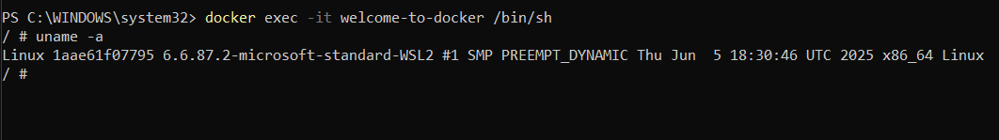
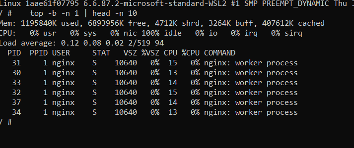
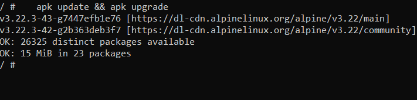
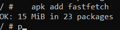
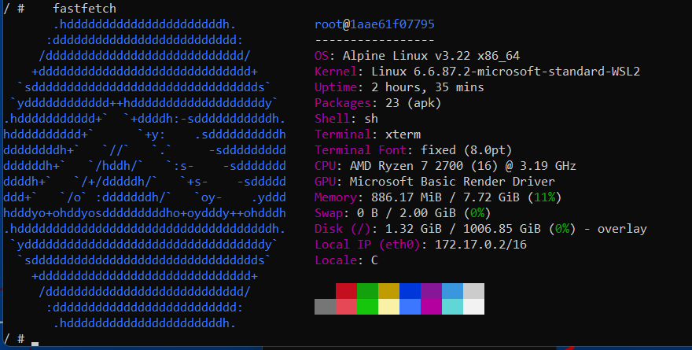

## Welcome to Docker

Это отчёт по заданию **Welcome to Docker**.

### 1. Подготовка окружения

- **ОС**: Windows (PowerShell)
- **Проверка порта 8088**:
  ```powershell
  netstat -aon | findstr :8088
  ```
  Команда ничего не вернула, поэтому порт **8088 свободен**.

### 2. Запуск контейнера `docker/welcome-to-docker`

- **Загрузка образа и запуск контейнера**:
  ```powershell
  docker run -d -p 8088:80 --name welcome-to-docker docker/welcome-to-docker
  ```
- После запуска контейнера веб-страница доступна по адресу:
  - `http://localhost:8088`

**Скриншот 1** — открытая страница Welcome to Docker в браузере:


*(поместите файл скриншота в папку `Docker/img` и поправьте имя файла при необходимости)*

### 3. Работа внутри контейнера

- **Вход в контейнер (интерактивно)**:
  ```powershell
  docker exec -it welcome-to-docker /bin/sh
  ```

Вместо интерактивного режима команды также были выполнены в неинтерактивном режиме одной строкой:

```powershell
docker exec welcome-to-docker /bin/sh -c "uname -a && echo '---' && top -b -n 1 | head -n 10 && echo '---' && apk update && apk upgrade && echo '---' && apk add fastfetch && echo '---' && fastfetch"
```

#### 3.1. Информация об ОС

Команда:

```sh
uname -a
```

Вывод (пример):

```text
Linux 1aae61f07795 6.6.87.2-microsoft-standard-WSL2 #1 SMP PREEMPT_DYNAMIC Thu Jun  5 18:30:46 UTC 2025 x86_64 Linux
```

**Скриншот 2** — вывод `uname -a`:





#### 3.2. Диспетчер ресурсов

Команда:

```sh
top
```

В неинтерактивном режиме использовалась команда:

```sh
top -b -n 1 | head -n 10
```

Пример части вывода:

```text
Mem: 1273724K used, 6816072K free, 4700K shrd, 6672K buff, 497148K cached
CPU:   0% usr   0% sys   0% nic 100% idle   0% io   0% irq   0% sirq
Load average: 0.16 0.04 0.01 2/512 54
  PID  PPID USER     STAT   VSZ %VSZ CPU %CPU COMMAND
   31     1 nginx    S    10640   0%  14   0% nginx: worker process
   30     1 nginx    S    10640   0%  13   0% nginx: worker process
   33     1 nginx    S    10640   0%  13   0% nginx: worker process
```

**Скриншот 3** — вывод `top`:





#### 3.3. Обновление пакетов

Команда:

```sh
apk update && apk upgrade
```

Пример вывода:

```text
fetch https://dl-cdn.alpinelinux.org/alpine/v3.22/main/x86_64/APKINDEX.tar.gz
fetch https://dl-cdn.alpinelinux.org/alpine/v3.22/community/x86_64/APKINDEX.tar.gz
OK: 26336 distinct packages available
...
OK: 11 MiB in 21 packages
```

**Скриншот 4** — процесс `apk update && apk upgrade`:





#### 3.4. Установка приложения `fastfetch`

Команда:

```sh
apk add fastfetch
```

Пример вывода:

```text
(1/2) Installing hwdata-pci (0.395-r0)
(2/2) Installing fastfetch (2.44.0-r0)
OK: 15 MiB in 23 packages
```

**Скриншот 5** — установка `fastfetch`:





#### 3.5. Запуск `fastfetch`

Команда:

```sh
fastfetch
```

Пример вывода (системная информация и ASCII‑арт):

```text
       .hddddddddddddddddddddddh.
      :dddddddddddddddddddddddddd:
     /dddddddddddddddddddddddddddd/
    +dddddddddddddddddddddddddddddd+
  `sdddddddddddddddddddddddddddddddds`
...
OS: Alpine Linux v3.22 x86_64
Kernel: Linux 6.6.87.2-microsoft-standard-WSL2
CPU: AMD Ryzen 7 2700 (16) @ 3.19 GHz
Memory: 882.64 MiB / 7.72 GiB
```

**Скриншот 6** — вывод `fastfetch`:





### 4. Завершение работы

При необходимости контейнер можно остановить и удалить:

```powershell
docker stop welcome-to-docker
docker rm welcome-to-docker
```

---

Ссылка на этот отчёт в GitHub:  
[`Docker/WelcomeToDocker/README.md`](https://github.com/xem1zo/IT/blob/main/Docker/WelcomeToDocker/README.md)
<<<<<<< HEAD

=======
>>>>>>> b088e9e22249e810ecb384dd565385ad99681761

