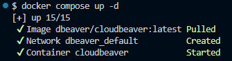
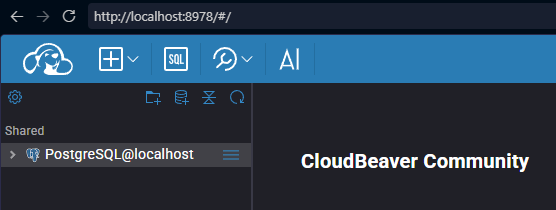
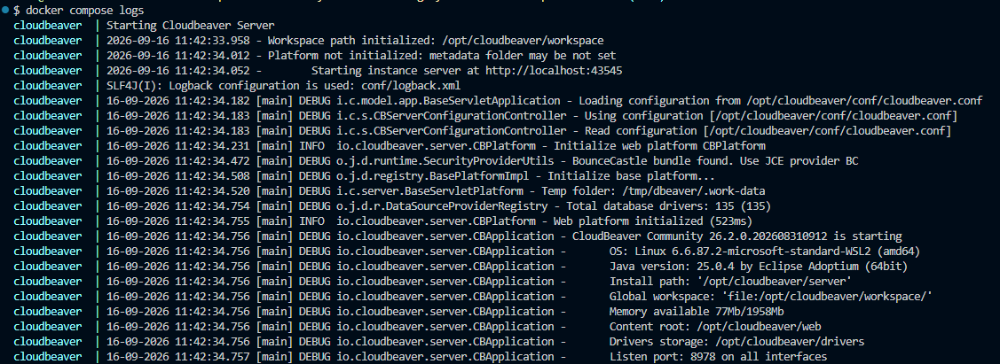
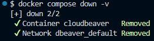

# Самостоятельная работа по Информационным технологиям, Docker Compose: DBeaver

## 1. Создание каталога проекта:

## 2. Запуск всех сервисов:

## 3. Веб-сайт:

## 4. Логи:

## 5. Остановка и удаление контейнеров и volumes:
