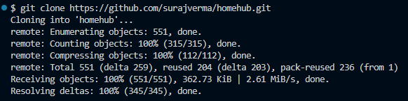
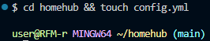
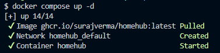
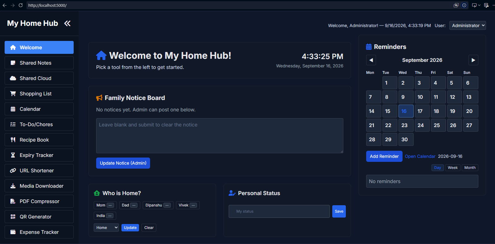
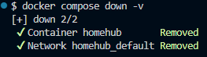

# Самостоятельная работа по Информационным технологиям, Docker Compose: Homehub

## 1. Клонирование и переход в нужную директорию:

## 2. Запуск всех сервисов:

## 3. Веб-сайт:

## 4. Остановка и удаление контейнеров и volumes:
