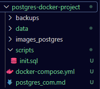
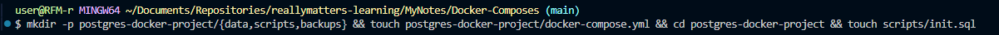
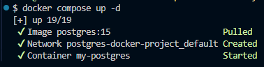
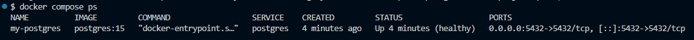
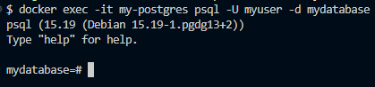
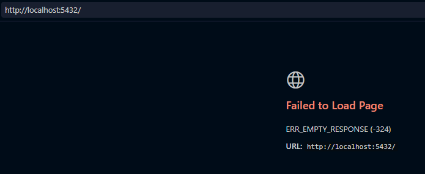
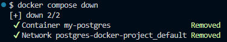

# Самостоятельная работа по Информационным технологиям, Docker Compose: PostgresSQL
## 1. Создание каталога проекта:

## 2. Запуск всех сервисов:
# 

## 3. Проверка статуса:
# 

## 4. Подключение к БД:
# 

## 5. Веб-сайт(который сейчас активен, но не отправляет никаких данных):
# 

## 6. Остановка и удаление контейнеров и volumes:
# 