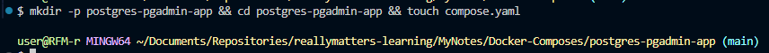
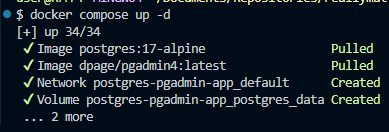
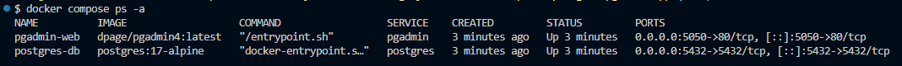
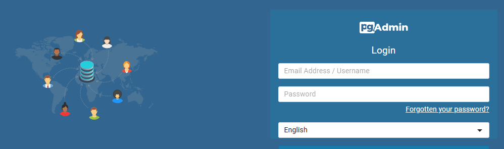
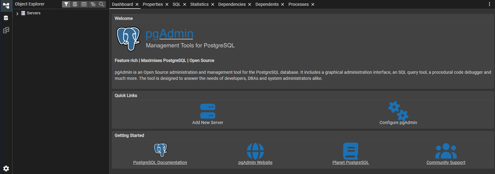
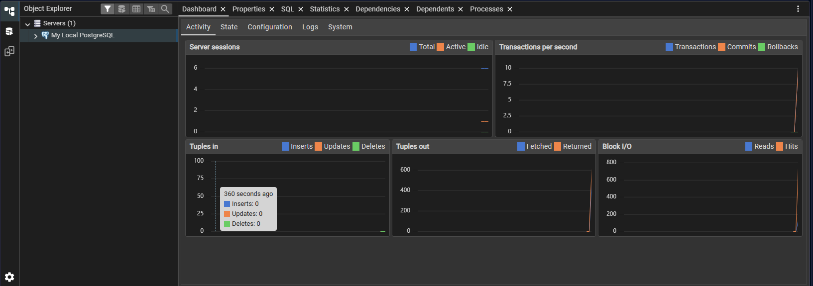
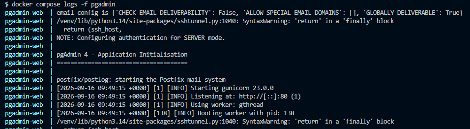
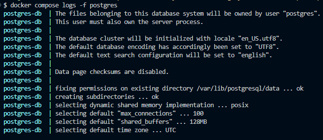
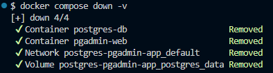

# Самостоятельная работа по Информационным технологиям, Docker Compose: PostgresSQL + pgAdmin
## 1. Создание каталога проекта:

## 2. Запуск всех сервисов:

## 3. Проверка статуса:

## 5. Веб-сайт:

## 6. Логи:
### (phpmyAdmin):

### (mySql):

## 7. Остановка и удаление контейнеров и volumes:
