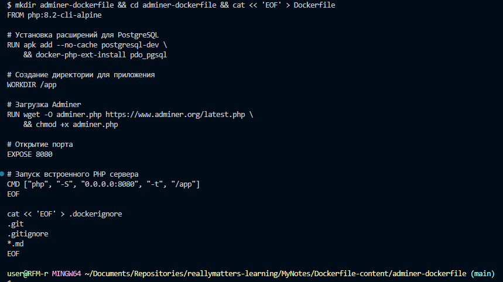
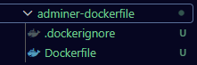
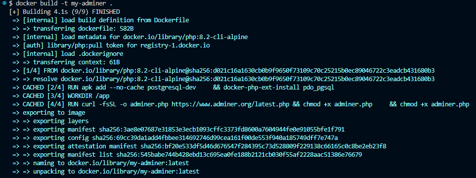
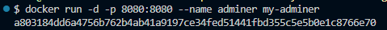
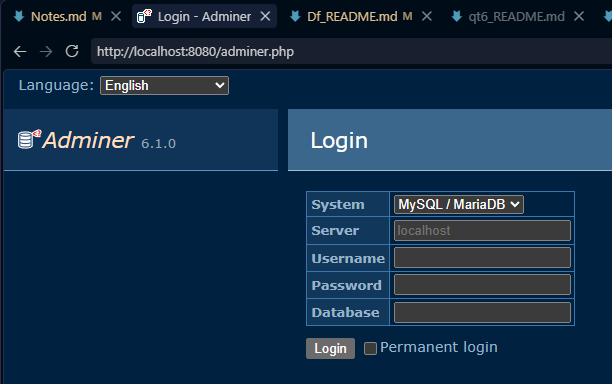

# Самостоятельная работа по Информационным технологиям, Dockerfile: PostgreSQL + Adminer

## 1. Создание структуры проекта:

## 2. Сборка и запуск:

## 3. Создание и запуск контейнера:

## 4. Веб-сайт(по ссылке: ../adminer.php , введя просто localhost, выдаст ошибку)
