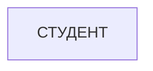
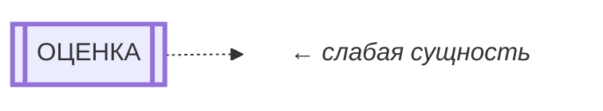
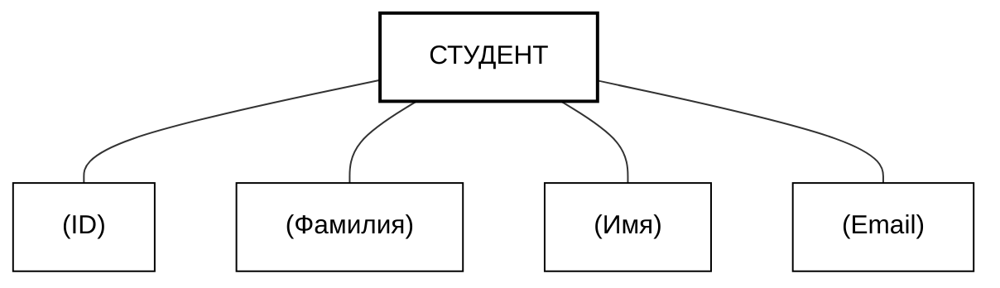
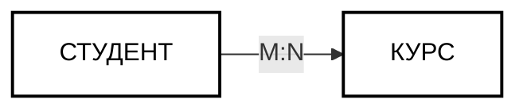
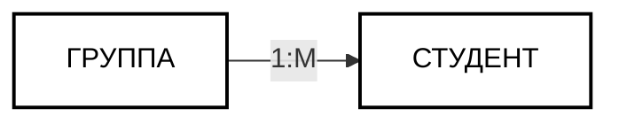
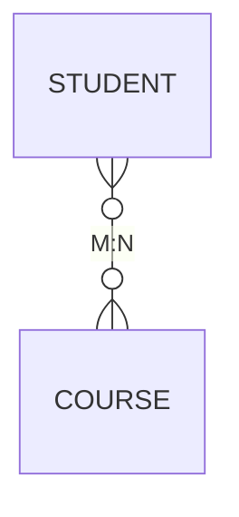
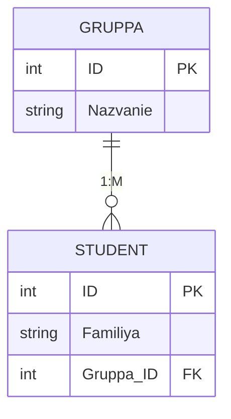
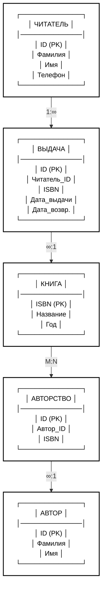
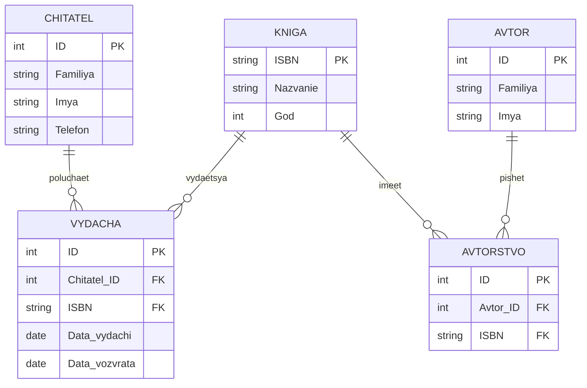

ER-диаграмма (Entity-Relationship diagram, диаграмма «сущность — связь») — это графическое представление концептуальной модели базы данных. Она показывает, **какие объекты (сущности) хранятся в БД и как они связаны между собой**, не привязываясь к конкретной СУБД или синтаксису SQL.

Проще говоря, ER-диаграмма — это «чертёж» базы данных, который понятен и программисту, и заказчику, и аналитику.

---

## 📌 Основные элементы ER-диаграммы

### 1. Сущность (Entity)
**Определение:** Объект реального мира, о котором мы хотим хранить информацию.

**Примеры:** `Студент`, `Курс`, `Преподаватель`, `Заказ`, `Товар`.

**Обозначение:** Прямоугольник с именем сущности (обычно в единственном числе, в верхнем регистре или с заглавной буквы).

```text
┌─────────────┐
│  СТУДЕНТ    │
└─────────────┘
```



**Виды сущностей:**
- **Сильная (strong):** Существует независимо, имеет собственный первичный ключ. Пример: `Студент` с ключом `ID_студента`.
- **Слабая (weak):** Не может существовать без другой сущности (родителя). Её ключ частично или полностью состоит из ключа родителя. Пример: `Оценка` существует только в связке со `Студентом` и `Курсом`. Обозначается двойным прямоугольником.

```text
╔═════════════╗
║   ОЦЕНКА    ║   ← слабая сущность
╚═════════════╝
```



---

### 2. Атрибут (Attribute)
**Определение:** Характеристика сущности, которая описывает её свойства.

**Примеры:** У сущности `Студент` — атрибуты `ID`, `Фамилия`, `Имя`, `Дата_рождения`, `Email`.

**Обозначение:** Овал, соединённый линией с прямоугольником сущности.

```text
┌─────────────┐
│  СТУДЕНТ    │
└──────┬──────┘
       │
   ┌───┴───┬────────┬─────────┐
   │       │        │         │
 (ID)  (Фамилия) (Имя)  (Email)
```



**Виды атрибутов:**

| Тип атрибута | Описание | Пример | Обозначение |
|--------------|----------|--------|-------------|
| **Простой** | Неделимый | `Возраст` | Обычный овал |
| **Составной** | Состоит из нескольких частей | `Адрес` = `Город` + `Улица` + `Дом` | Овал с вложенными овалами |
| **Однозначный** | Одно значение для сущности | `Дата_рождения` | Обычный овал |
| **Многозначный** | Несколько значений | `Телефоны` (у студента их может быть несколько) | Двойной овал |
| **Производный** | Вычисляется из других | `Возраст` (вычисляется из `Даты_рождения`) | Пунктирный овал |
| **Ключевой** | Уникально идентифицирует сущность | `ID_студента` | Подчёркнутый овал |

---

### 3. Связь (Relationship)
**Определение:** Ассоциация между двумя или более сущностями, показывающая, как они взаимодействуют.

**Примеры:** `Студент` *посещает* `Курс`, `Клиент` *делает* `Заказ`, `Преподаватель` *читает* `Лекцию`.

**Обозначение:** Ромб с именем связи (глагол или отглагольное существительное), соединённый линиями с сущностями.

```
┌───────────┐         ┌───────────┐
│  СТУДЕНТ  │────◇────│   КУРС    │
└───────────┘ посещает└───────────┘
```



---

## 🔗 Типы связей (мощность связи, cardinality)

Мощность связи показывает, **сколько экземпляров одной сущности может быть связано с экземпляром другой**.

### 1. Один-к-одному (1:1)
Одному экземпляру A соответствует ровно один экземпляр B.

**Пример:** `Студент` — `Зачётная_книжка`. У одного студента одна зачётка, у одной зачётки — один владелец.

**Обозначение:** `1 —— 1`

---

### 2. Один-ко-многим (1:M)
Одному экземпляру A соответствует много экземпляров B, но каждый B связан только с одним A.

**Пример:** `Группа` — `Студент`. В одной группе много студентов, но каждый студент учится только в одной группе.

**Обозначение:** `1 —— M` или `1 —— ∞`

```
┌───────────┐         ┌───────────┐
│  ГРУППА   │────1:M──│  СТУДЕНТ  │
└───────────┘         └───────────┘
```


---

### 3. Многие-ко-многим (M:N)
Одному экземпляру A соответствует много экземпляров B, и наоборот.

**Пример:** `Студент` — `Курс`. Один студент посещает много курсов, один курс посещают много студентов.

**Обозначение:** `M —— N`

```
┌───────────┐         ┌───────────┐
│  СТУДЕНТ  │────M:N──│   КУРС    │
└───────────┘         └───────────┘
```



⚠️ **Важно:** Связь M:N **не может быть напрямую реализована** в реляционной БД. На этапе логического проектирования она разрешается через **промежуточную (ассоциативную) таблицу**.

---

## 🎨 Нотации ER-диаграмм

Существует несколько способов изображения ER-диаграмм. Две самые популярные:

### 1. Нотация Чена (классическая)
- Сущности — прямоугольники.
- Атрибуты — овалы.
- Связи — ромбы.
- Мощность подписывается на линиях (`1`, `M`, `N`).

**Плюс:** Наглядная, подходит для обучения.
**Минус:** Занимает много места при большом количестве атрибутов.

---

### 2. Нотация «Воронья лапка» (Crow's Foot)
- Сущности — прямоугольники со списком атрибутов внутри.
- Связи — линии между прямоугольниками.
- Мощность показывается специальными символами на концах линий:

| Символ | Значение |
|--------|----------|
| `—|—` | Ровно один (1) |
| `—<` | Много (N) |
| `—o` | Ноль или один (0..1) |
| `—o<` | Ноль или много (0..N) |
| `—|<` | Один или много (1..N) |

**Пример:**
```
┌─────────────┐         ┌─────────────┐
│  ГРУППА     │         │  СТУДЕНТ    │
│─────────────│         │─────────────│
│ ID (PK)     │──1───∞──│ ID (PK)     │
│ Название    │         │ Фамилия     │
└─────────────┘         │ Группа_ID(FK)│
                        └─────────────┘
```

**Плюс:** Компактная, используется в профессиональных CASE-средствах (ERwin, DBeaver, dbdiagram.io).
**Минус:** Менее наглядна для новичков.



---

## 🔄 Как ER-диаграмма превращается в таблицы

Это ключевой навык при проектировании. Правила перехода:

| Элемент ER-модели | Преобразование в реляционную модель |
|-------------------|-------------------------------------|
| **Сильная сущность** | Таблица с первичным ключом |
| **Слабая сущность** | Таблица с составным первичным ключом (свой + ключ родителя) |
| **Простой атрибут** | Столбец в таблице |
| **Составной атрибут** | Разбивается на несколько столбцов |
| **Многозначный атрибут** | Выносится в отдельную таблицу |
| **Связь 1:1** | Внешний ключ в одной из таблиц (обычно в той, что обязательна) |
| **Связь 1:M** | Внешний ключ на стороне «много» |
| **Связь M:N** | Создаётся **промежуточная таблица** с двумя внешними ключами |

---

## 📝 Пример: ER-диаграмма для библиотеки

**Сущности:**
- `Читатель` (ID, Фамилия, Имя, Телефон)
- `Книга` (ISBN, Название, Год)
- `Автор` (ID, Фамилия, Имя)

**Связи:**
- `Читатель` — `Книга`: M:N (читатель берёт много книг, книгу берут многие) → промежуточная таблица `Выдача` (ID_читателя, ISBN, Дата_выдачи, Дата_возврата).
- `Автор` — `Книга`: M:N (у книги может быть несколько авторов, автор пишет много книг) → промежуточная таблица `Авторство` (ID_автора, ISBN).

**ER-диаграмма (нотация «воронья лапка»):**
```
┌─────────────┐       ┌─────────────┐       ┌─────────────┐
│  ЧИТАТЕЛЬ   │       │   ВЫДАЧА    │       │    КНИГА    │
│─────────────│       │─────────────│       │─────────────│
│ ID (PK)     │──1─∞─│ ID (PK)     │       │ ISBN (PK)   │
│ Фамилия     │       │ Читатель_ID │∞────1─│ Название    │
│ Имя         │       │ ISBN        │       │ Год         │
│ Телефон     │       │ Дата_выдачи │       └──────┬──────┘
└─────────────┘       │ Дата_возвр. │              │
                      └─────────────┘              │
                                                   │ M:N
                                                   │
                      ┌─────────────┐              │
                      │  АВТОРСТВО  │              │
                      │─────────────│              │
                      │ ID (PK)     │              │
                      │ Автор_ID    │∞─────────────┘
                      │ ISBN        │
                      └──────┬──────┘
                             │
                      ┌──────┴──────┐
                      │   АВТОР     │
                      │─────────────│
                      │ ID (PK)     │
                      │ Фамилия     │
                      │ Имя         │
                      └─────────────┘
```





---

## 🛠️ Инструменты для создания ER-диаграмм

| Инструмент | Тип | Особенность |
|------------|-----|-------------|
| **dbdiagram.io** | Веб | Простой, бесплатный, экспорт в SQL |
| **Draw.io (diagrams.net)** | Веб/десктоп | Бесплатный, гибкий, много шаблонов |
| **DBeaver** | Десктоп | Обратное проектирование из БД |
| **CloudBeaver** | Веб (Docker) | Визуальный редактор в браузере |
| **ERwin** | Десктоп | Профессиональный, стандарт индустрии |
| **Lucidchart** | Веб | Совместная работа, интеграции |

---

## ✅ Итог: зачем нужны ER-диаграммы

1. **Визуализация** — сложную структуру БД видно на одном листе.
2. **Общение** — понятна и техническим специалистам, и заказчикам.
3. **Документирование** — служит официальной схемой БД.
4. **Основа для генерации SQL** — CASE-средства автоматически создают код.
5. **Поиск ошибок** — легче заметить дублирование, пропущенные связи, аномалии.

ER-диаграмма — это **первый и самый важный шаг** в проектировании базы данных. Если она построена правильно, то и реализация в SQL будет логичной, а база — эффективной.

Если хотите, могу показать, как построить ER-диаграмму для конкретной предметной области (например, интернет-магазин, больница, университет) или разобрать нотацию «воронья лапка» детальнее!

> Если вы обнаружили ошибку в этом тексте - сообщите пожалуйста автору!