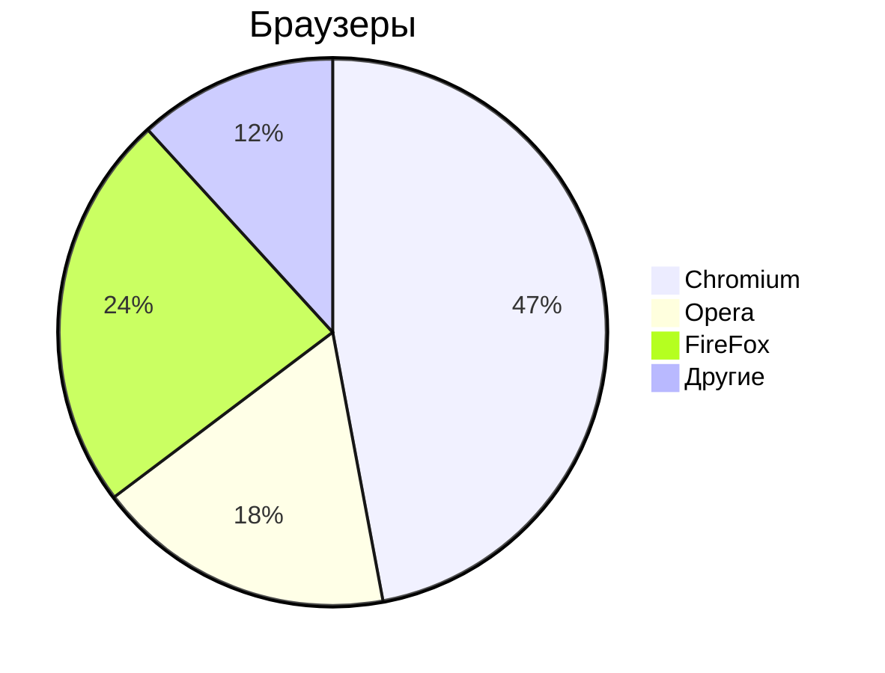

# Markdown

- [Основы редактирования текста](/content/Text.md)

## Заголовки

# - Заголовок 1-го уровня
## - Заголовок 2-го уровня
### - Заголовок 3-го уровня
#### - Заголовок 4-го уровня

### Текст

- **Жирный текст**
- *Курсив*
- ~~Зачёркнутый текст~~
- <u>Подчёркнутый текст</u>

### Горизонтальные линии

---

***

### Списки

#### Ненумерованный

- Пункт 1
- Пункт 2

* Пункт 1
* Пункт 2
    - Пункт 1
    - Пункт 2

#### Нумерованный список

1. Пункт 1
1. Пункт 2
1. Пункт 3
1. Пункт 4
1. Пункт 5
1. Пункт 6

### Ссылки

#### Внутренние ссылки

[Текст ссылки](/content/Mermaid/README.md)

### Якоря по документу

- [Редактирование текста](#text-editor)

### Внешние ссылки

- [ОЗОН](https://ozon.ru)

### Изображения


### Код

`Ctrl+R` - обновить страницу браузера
`F5`     - обновить страницу браузера

```python
print('Hello');
```
```cpp
int main() {
    pust("Hello");
}
```

### Mermaid



### Цитаты

> Тут важный текст
> Цитата 1
> Цитата 2

### Таблицы

| Заголовок 1 | Заголовок 2 | Заголовок 3 |
|-------------|-------------|-------------|
| Ячейка 1    | Ячекйка 2   | Ячейка 3    |
| Ячейка 4    | Ячекйка 5   | Ячейка 6    |
|             |             |             |

### Список задач

- [х] Закрытая задача
- [ ] Открытая задача

***


