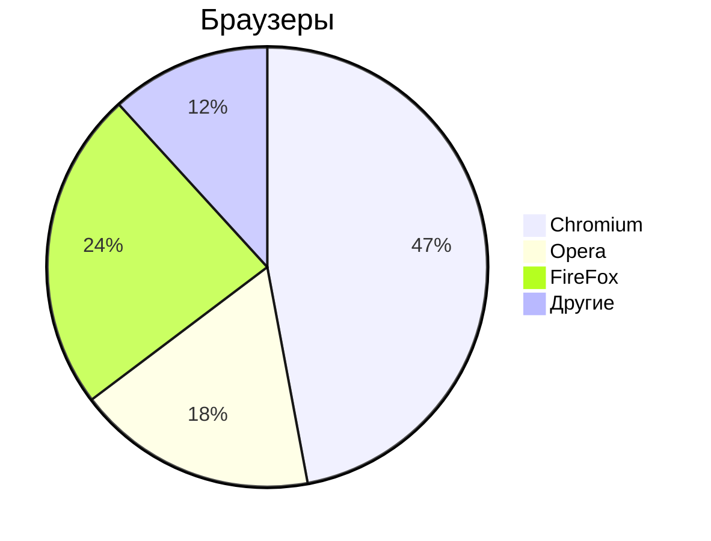

# Markdown

**Markdown** - простое форматирование документа, пригодное для Git-репозиториев, документации и заметок.

## Основы редактирования текста по горячим клавишам

### Курсор

Клавиши

- `Home`   - курсор в начало строки
- `END`    - курсор в конец строки
- `pgUP`   - курсор вверх видимой части документа
- `pgDOWN` - курсор вниз видимой части документа

### Выделение текста

- `Ctrl+A` - выделить весь текст
- `Ctrl+>` - выделить символ справа от курсора
- `Ctrl+<` - выделить символ слева от курсора
- `Ctrl+S` - сохранить документ
- `Ctrl+C` - копировать выделенное
- `Ctrl+V` - вставить выделенное
- `Shift+>` - посимвольное выделение вправо
- `Shift+<` - посимвольное выделение влево
- `Crtl+Shift+>` - пословное выделение текста вправо
- `Crtl+Shift+<` - пословное выделение текста влево

### Копирование/вставка

- `Ctrl+Shift+C` - копировать выделенное в терминале
- `Ctrl+Shift+V` - вставить   выделенное в терминале

### TEXT EDITOR
### Редактирование текста

- `Del` - удалить символ справа от курсора
- `Backspace` - удалить символ слева от курсора
- `Ins/Insert` - замещение старого текста новым справа от курсора
- `Ctrl+>` - перемещение по словам вправо
- `Ctrl+<` - перемещение по словам влево

---

## Markdown

Заголовки

# - Заголовок 1-го уровня
## - Заголовок 2-го уровня
### - Заголовок 3-го уровня
#### - Заголовок 4-го уровня

Текст

- **Жирный текст**
- *Курсив*
- ~~Зачёркнутый текст~~
- <u>Подчёркнутый текст</u>

Горизонтальные линии

---

***

Списки

Ненумерованный

- Пункт 1
- Пункт 2

* Пункт 1
* Пункт 2
    - Пункт 1
    - Пункт 2

Нумерованный список

1. Пункт 1
1. Пункт 2
1. Пункт 3
1. Пункт 4
1. Пункт 5
1. Пункт 6

Ссылки

Внутренние ссылки

[Текст ссылки](/content/Mermaid/README.md)

Якоря по документу

- [Редактирование текста](#text-editor)

Внешние ссылки

- [ОЗОН](https://ozon.ru)

Изображения


Код

`Ctrl+R` - обновить страницу браузера
`F5`     - обновить страницу браузера

```python
print('Hello');
```
```cpp
int main() {
    pust("Hello");
}
```


Цитаты

> Тут важный текст
> Цитата 1
> Цитата 2

Таблицы

| Заголовок 1 | Заголовок 2 | Заголовок 3 |
|-------------|-------------|-------------|
| Ячейка 1    | Ячекйка 2   | Ячейка 3    |
| Ячейка 4    | Ячекйка 5   | Ячейка 6    |
|             |             |             |

Список задач

- [х] Закрытая задача
- [ ] Открытая задача

***


