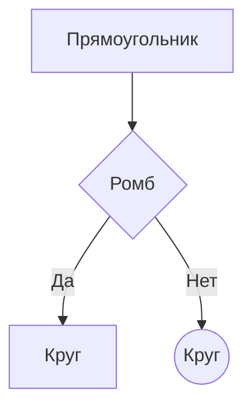
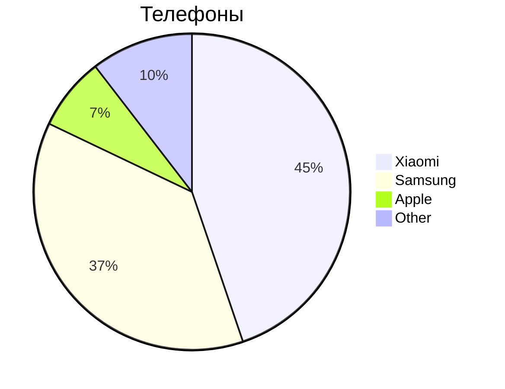

## Mermaid

**Mermaid** - специальный язык для построения диаграмм, блок-схем и графиков

#### Блок-схема

- `TD` - направление сверху-вниз
- `-->` - стрелка связи
- `|Текст|` - подпись стрелки
- `{Text}` - ромб (условие)

#### Круговая диаграмма

// Самостоятельно создайте новый файл типа task_mermaid.md со всеми возможными примерами блок-схем, графиков и диаграмм