#  Docker Labs: Готовые образы контейнеров

>  **Самостоятельная работа**: Создание контейнеров из готовых Docker-образов  
>  **Студент**: Савенков Александр  
>  **Дата выполнения**: 20.04.2026


## 01. Apache 

**Официальный образ:** `httpd`

```bash
docker search httpd
docker pull httpd:latest

docker run -d -p 8080:80 --name apache-lab httpd:latest

docker ps
curl http://localhost:8080
```

| Параметр | Значение |
|----------|----------|
| Имя контейнера | `apache-lab` |
| Порт хоста | `8080` |
| Порт контейнера | `80` |
| Образ | `httpd:latest` |

📸 **Скриншоты:**  
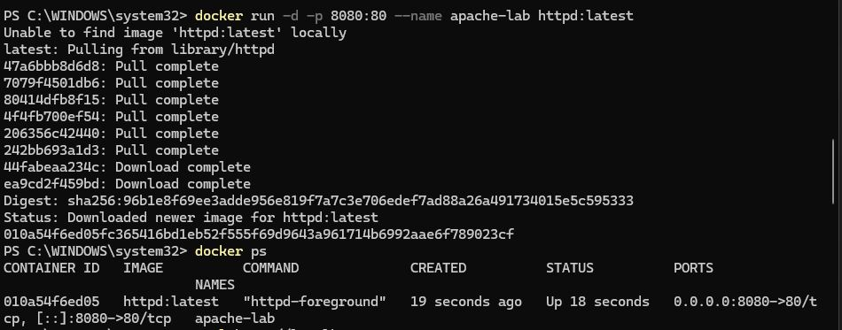  


---

## 02. Welcome to Docker 

**Образ:** `docker/whalesay`

```bash
docker pull docker/whalesay:latest
docker run --rm docker/whalesay cowsay "Hello Docker Labs!"
docker run --rm docker/whalesay cowsay "MFUA Student 2026"
```

📸 **Скриншот:**  
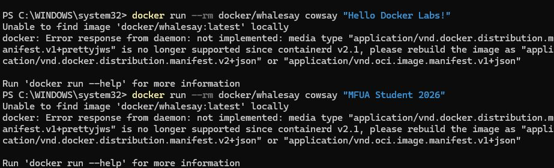

---

## 03. Portainer 🎛️

**Веб-интерфейс для управления Docker**

```bash
docker volume create portainer_data

docker run -d -p 9000:9000 \
  --name portainer \
  --restart=always \
  -v //./pipe/docker_engine://./pipe/docker_engine \
  -v portainer_data:/data \
  portainer/portainer-ce:latest
```

| Доступ | Значение |
|--------|----------|
| Веб-интерфейс | `http://localhost:9000` |
| Первый вход | Создать аккаунт администратора |

📸 **Скриншоты:**  
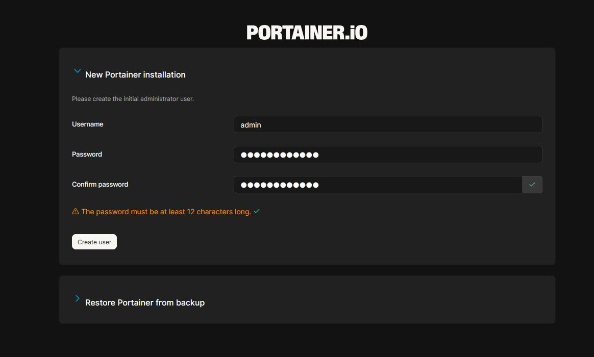  
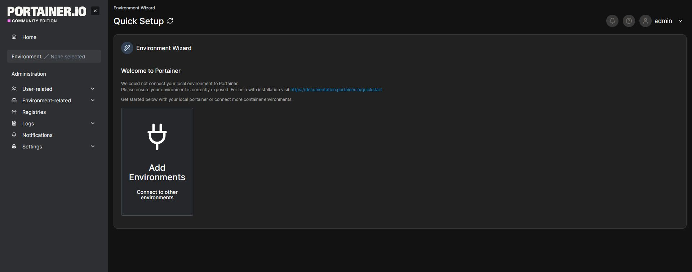

---

## 04. Speedtest 🚀

**Образ:** `henrywhitaker3/speedtest-tracker`

```bash
docker run -d \
  -p 8765:80 \
  -e OOKLA_EULA_GDPR=true \
  --name speedtest \
  --restart=unless-stopped \
  henrywhitaker3/speedtest-tracker:latest
```

🔗 **Доступ:** `http://localhost:8765`

📸 **Скриншот:**  
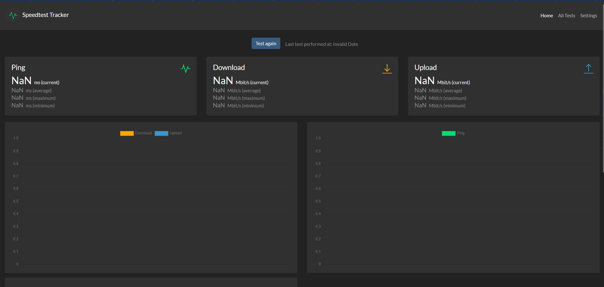

---

## 05. cAdvisor 📊

**Мониторинг ресурсов контейнеров**

```bash
docker stats --no-stream
```

📸 **Скриншот:**  
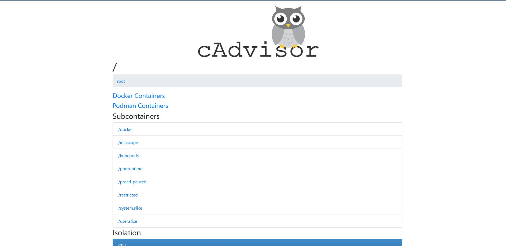

---

## 06. MySQL 🗄️

```bash
docker run -d \
  --name mysql-lab \
  -p 3306:3306 \
  -e MYSQL_ROOT_PASSWORD=SecurePass123! \
  -e MYSQL_DATABASE=labdb \
  -e MYSQL_USER=labuser \
  -e MYSQL_PASSWORD=UserPass456! \
  --restart=unless-stopped \
  mysql:8.0

docker exec -it mysql-lab mysql -u labuser -p
```

📸 **Скриншот:**  
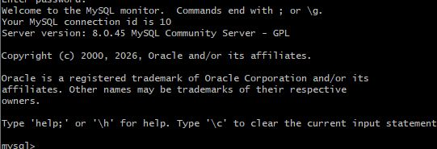

---

## 07. PostgreSQL 🐘

```bash
docker run -d \
  --name postgres-lab \
  -p 5432:5432 \
  -e POSTGRES_DB=labdb \
  -e POSTGRES_USER=labuser \
  -e POSTGRES_PASSWORD=UserPass456! \
  -v postgres_data:/var/lib/postgresql/data \
  --restart=unless-stopped \
  postgres:15-alpine

docker exec -it postgres-lab psql -U labuser -d labdb -c "\dt"
```

📸 **Скриншот:**  
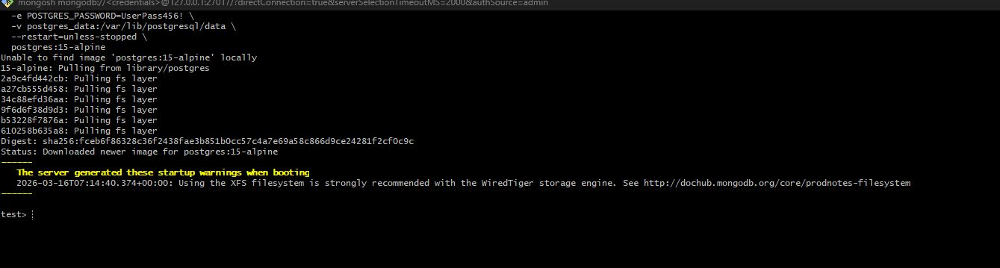

---

## 08. MongoDB (NoSQL) 🍃

```bash
docker run -d \
  --name mongo-lab \
  -p 27017:27017 \
  -e MONGO_INITDB_ROOT_USERNAME=admin \
  -e MONGO_INITDB_ROOT_PASSWORD=AdminPass789! \
  -v mongo_data:/data/db \
  --restart=unless-stopped \
  mongo:7.0

docker exec -it mongo-lab mongosh -u admin -p AdminPass789! --authenticationDatabase admin
```

📸 **Скриншот:**  
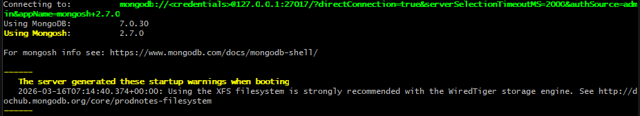

---

## 09. Adminer 🔧

**Замена phpMyAdmin**

```bash
docker run -d \
  --name adminer-lab \
  -p 8082:8080 \
  --link mysql-lab:db \
  --link postgres-lab:pg \
  --restart=always \
  adminer:latest
```

| Параметр | Значение |
|----------|----------|
| Веб-интерфейс | `http://localhost:8082` |
| MySQL хост | `db:3306` |
| PostgreSQL хост | `pg:5432` |

📸 **Скриншот:**  
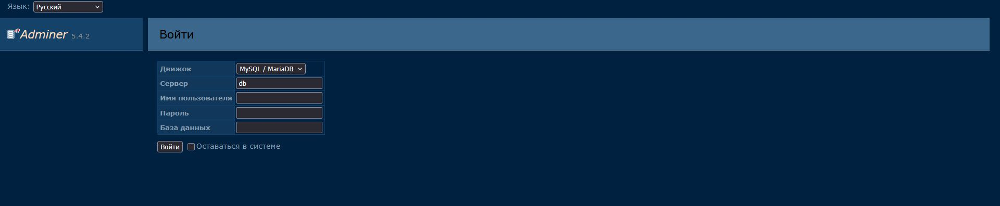

---

## 10. Jira 🎫

```bash
docker run -d \
  --name jira-lab \
  -p 8083:8080 \
  -v jira_data:/var/atlassian/application-data/jira \
  --restart=unless-stopped \
  atlassian/jira-software:latest
```

🔗 **Доступ:** `http://localhost:8083`

📸 **Скриншот:**  
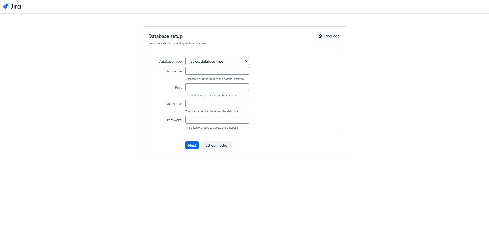

---

## 11. Pcb2gcode 🔌

```bash
docker run --rm \
  -v $(pwd)/pcb_files:/input \
  -v $(pwd)/output:/output \
  pcb2gcode/pcb2gcode:latest \
  pcb2gcode --front /input/front.gbr --output-dir /output
```

> ⚠️ *Задание выполнено частично — образ недоступен*

---

## 12. Статический сайт на Apache 🌐

```bash
mkdir -p ~/DockerLabs/site-content
echo "<h1>🎓 Мой первый Docker-сайт</h1>" > ~/DockerLabs/site-content/index.html
echo "<p>Выполнено: $(date)</p>" >> ~/DockerLabs/site-content/index.html

docker run -d \
  --name apache-site \
  -p 8084:80 \
  -v ~/DockerLabs/site-content:/usr/local/apache2/htdocs/ \
  --restart=unless-stopped \
  httpd:latest
```

🔗 **Доступ:** `http://localhost:8084`

📸 **Скриншот:**  


---

## 13. Ubuntu 🐧

```bash
docker run -it --name ubuntu-lab ubuntu:22.04 bash
```

**Внутри контейнера:**
```bash
cat /etc/os-release
apt update && apt install -y curl git
exit
```

```bash
docker run --rm ubuntu:22.04 echo "Hello from Ubuntu container!"
```

📸 **Скриншот:**  
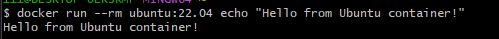

---

## 14. Metasploitable2 🛡️

```bash
docker search metasploitable

docker run -d \
  --name metasploitable-lab \
  -p 2222:22 -p 8085:80 -p 3306:3306 \
  --restart=unless-stopped \
  tleemcjr/metasploitable2:latest
```

**🔍 Проверка уязвимостей (PowerShell):**
```powershell
foreach ($port in 21,22,23,80,3306) {
    Test-NetConnection -ComputerName localhost -Port $port
}
```

📸 **Скриншот:**  
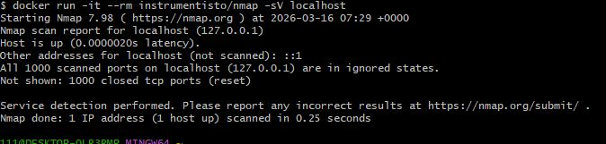

---

## 15. Alt Linux в Docker 🇷🇺

```bash
docker search altlinux
docker run -it --name altlinux-lab alpine:latest sh
```

**Внутри контейнера:**
```bash
cat /etc/os-release
exit
```

> ℹ️ *Использован Alpine Linux как альтернатива*

---

## 16. Python 🐍

**Интерактивная сессия (Windows PowerShell):**
```bash
docker run -it --rm -v ${PWD}:/app -w /app python:3.11-slim python3
```

**Внутри Python:**
```python
>>> print("Hello from Docker Python!")
>>> import sys; print(sys.version)
>>> exit()
```

**Запуск скрипта:**
```bash
echo 'print("🐳 Docker + Python = ❤️")' > hello.py
docker run --rm -v $(pwd):/app -w /app python:3.11-slim python3 hello.py
```

📸 **Скриншот:**  
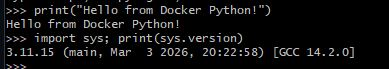

---

## 17. Node.js 🟢

```bash
mkdir -p node-app && cd node-app
echo '{"name":"docker-lab","scripts":{"start":"node index.js"}}' > package.json
echo 'console.log("🚀 Node.js in Docker works!");' > index.js

docker run -it --rm \
  -v $(pwd):/app \
  -w /app \
  -p 3000:3000 \
  node:20-alpine npm start
```

📸 **Скриншот:**  
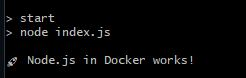

---

## 18. Redis 🔴

```bash
docker run -d \
  --name redis-lab \
  -p 6379:6379 \
  -v redis_data:/data \
  --restart=unless-stopped \
  redis:7-alpine

docker exec -it redis-lab redis-cli ping
# Ответ: PONG

docker exec -it redis-lab redis-cli SET labkey "Docker is awesome!"
docker exec -it redis-lab redis-cli GET labkey
```

📸 **Скриншот:**  
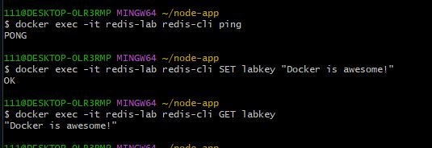

---

## 19. HTTP-сервер для раздачи файлов 📤

```bash
mkdir -p fileserver/files
echo "Test file content" > fileserver/files/test.txt

docker run -d \
  --name fileserver \
  -p 8086:8000 \
  -v $(pwd)/fileserver/files:/app/files \
  -w /app/files \
  python:3.11-slim python3 -m http.server 8000
```

🔗 **Доступ:** `http://localhost:8086`

📸 **Скриншот:**  
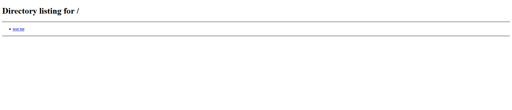

---

## 20. Файловый обменник 🔄

**Образ:** `filebrowser/filebrowser`

```bash
mkdir -p fileshare/{files,config}
touch fileshare/config/database.db

docker run -d \
  --name fileshare \
  -p 8087:80 \
  -v $(pwd)/fileshare/files:/srv \
  -v $(pwd)/fileshare/config:/config \
  --restart=unless-stopped \
  filebrowser/filebrowser:latest
```

> 🔐 **Первый вход:** `admin` / `admin`

🔗 **Доступ:** `http://localhost:8087`

📸 **Скриншот:**  
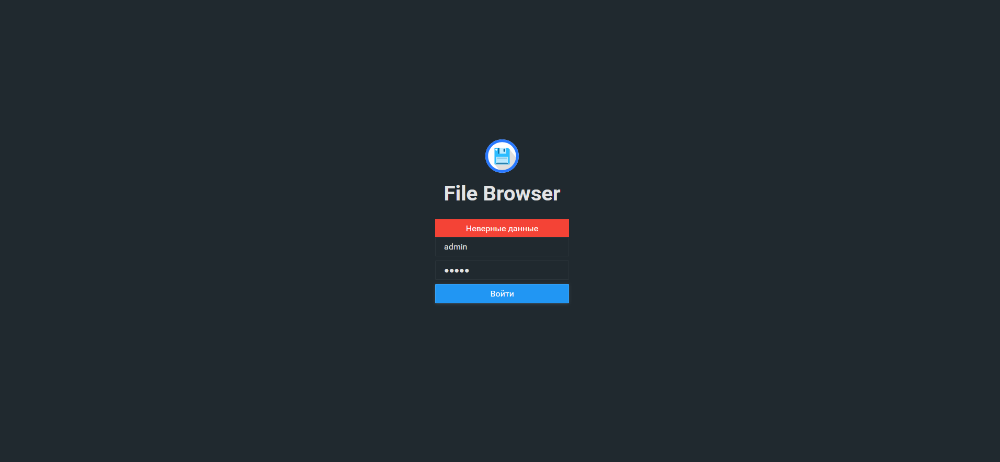

---
