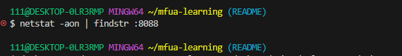
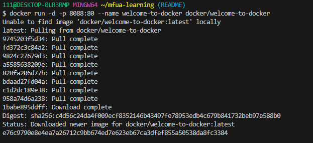
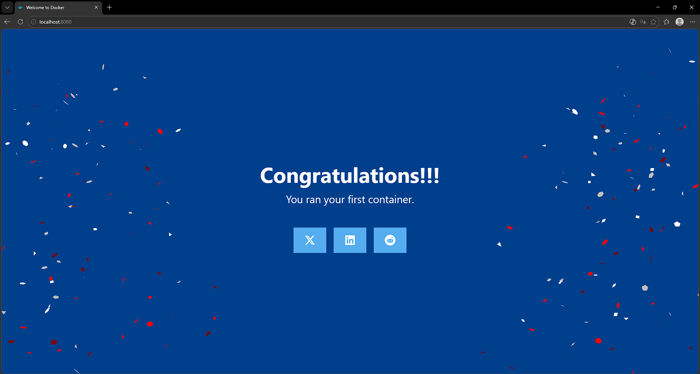
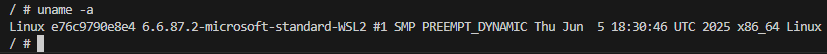
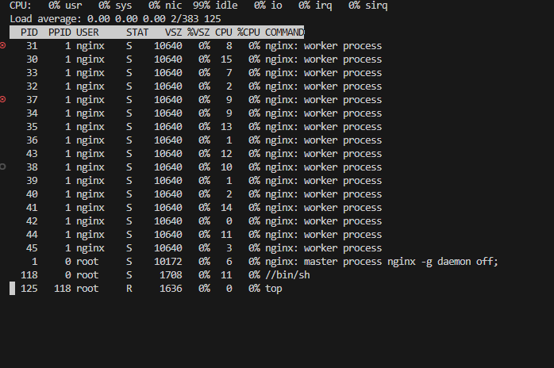
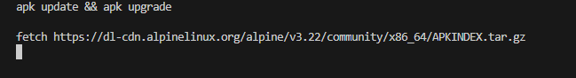
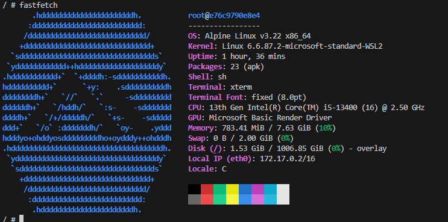

# 🐳 Самостоятельная работа: Знакомство с Docker

> ⚠️ **Внимание!** Перед началом работы убедитесь, что **порт 8088 свободен**.

---

## 📋 Задание 1. Проверить, свободен ли порт 8088

**Команды для проверки:**

| ОС | Команда |
|----|---------|
| Linux/Mac/WSL | `netstat -tuln \| grep :8088` |
| Windows | `netstat -aon \| findstr :8088` |

### 🖼️ Моё выполнение
> *Вставьте скриншот ниже:*



---

## 📋 Задание 2. Загрузить образ и запустить контейнер

```bash
docker run -d -p 8088:80 --name welcome-to-docker docker/welcome-to-docker
```

### 🖼️ Моё выполнение
> *Вставьте скриншот ниже:*



---

## 📋 Задание 3. Открыть приложение в браузере

**URL:** `http://localhost:8088`

### 🖼️ Моё выполнение
> *Вставьте скриншот ниже:*



---

## 📋 Задание 4. Зайти в контейнер

```bash
docker exec -it welcome-to-docker /bin/sh
```


---

## 📋 Задание 5. Показать информацию об ОС

```bash
uname -a
```

### 🖼️ Моё выполнение
> *Вставьте скриншот ниже:*



---

## 📋 Задание 6. Запустить диспетчер ресурсов

```bash
top
```

### 🖼️ Моё выполнение
> *Вставьте скриншот ниже:*



---

## 📋 Задание 7. Обновить источники приложений

```bash
apk update && apk upgrade
```

### 🖼️ Моё выполнение
> *Вставьте скриншот ниже:*



---

## 📋 Задание 8. Установить приложение fastfetch

```bash
apk add fastfetch
```

---

## 📋 Задание 9. Запустить fastfetch

```bash
fastfetch
```

### 🖼️ Моё выполнение
> *Вставьте скриншот ниже:*



---

| | |
|---|---|
| **Выполнил(а):** | Савенков Александр |
| **Группа:** | Ипо8482 |
| **Дата:** | 02.03.26 |

---