# 1. Apache

## Получить образ, создать и запустить контейнер:

**docker run -d --name my-apache -p 8081:80 httpd**

Откройте адрес http://localhost:8081 в браузере

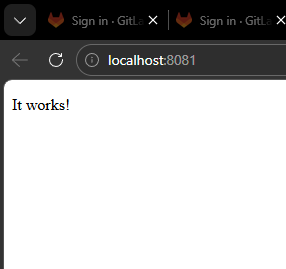

---

## Редактирование веб-страницы

**Открыть файл index.html для редактирования содержимого**

## micro /usr/local/apache2/htdocs/index.html

**Отредактируйте, сохраните по Ctrl+S и выйдите из режима редактирования по Ctrl+Q**

---

# 2. Welcome to Docker

Проверить порт 8088 для Windows:

**netstat -aon | findstr :8088**
Загрузить образ и запустить контейнера

**docker run -d -p 8088:80 --name welcome-to-docker docker/welcome-to-docker**
Открыть http://localhost:8088 в браузере

---

## Зайти в контейнер

**docker exec -it welcome-to-docker /bin/sh**

---

## Повыполнять разные команды:

### Показать ин-фу по ОС

**uname -a**

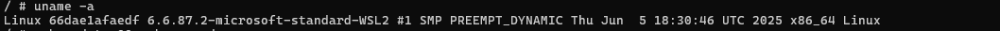
---

### Диспетчер ресурсов

**top**

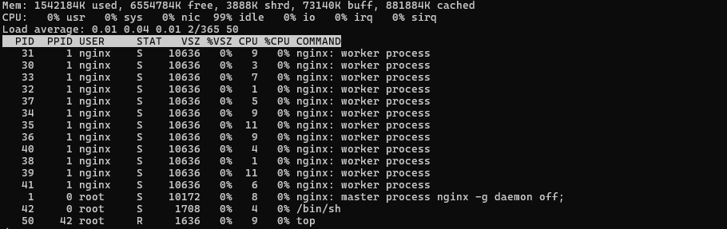
---

### Обновить источники приложений

**apk update && apk upgrade**

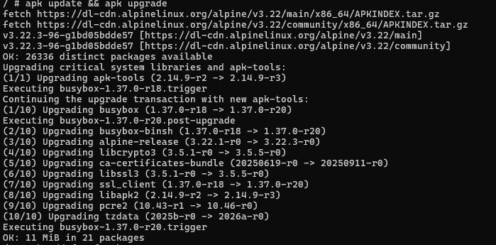

---

### Установить приложение

**apk add fastfetch**

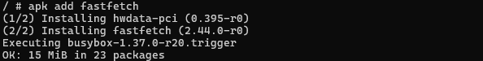

---

### Запустить приложение

**fastfetch**

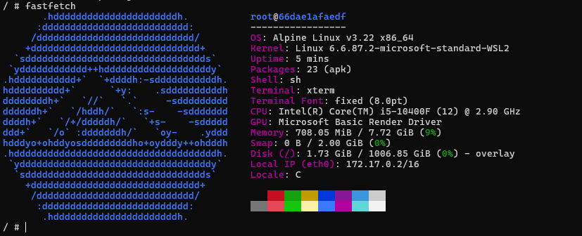

---

# 3. Portainer

## Вариант с томами (с сохранением данных)

### В Windows Powershell

```
docker run -d `
  --name portainer `
  -p 9000:9000 `
  -p 9443:9443 `
  -v /var/run/docker.sock:/var/run/docker.sock `
  -v portainer_data:/data `
  --restart unless-stopped `
  portainer/portainer-ce:latest

```
### В Git-Bash/Linux/WSL 2.0/Mac

```

docker run -d \
  --name portainer \
  -p 9000:9000 \
  -p 9443:9443 \
  -v /var/run/docker.sock:/var/run/docker.sock \
  -v portainer_data:/data \
  --restart unless-stopped \
  portainer/portainer-ce:latest

```

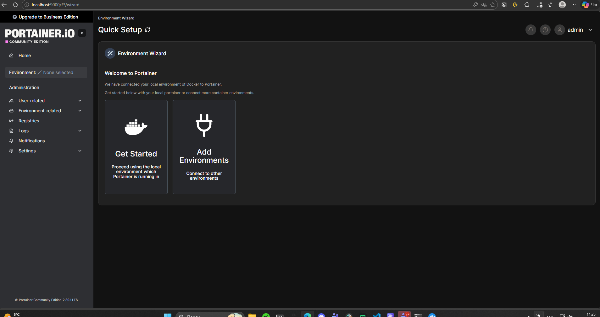

---

# 4 Тест скорости интернета (в РФ может не работать из-за блокировок РКН!)

## Speedtest в Docker

**docker run -d -p 158:80 --name speedtest-server adolfintel/speedtest**

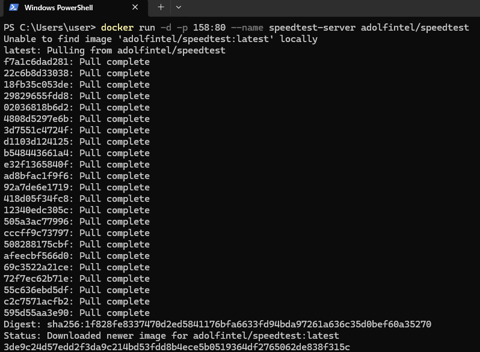

Открыть в браузере http://localhost:158/

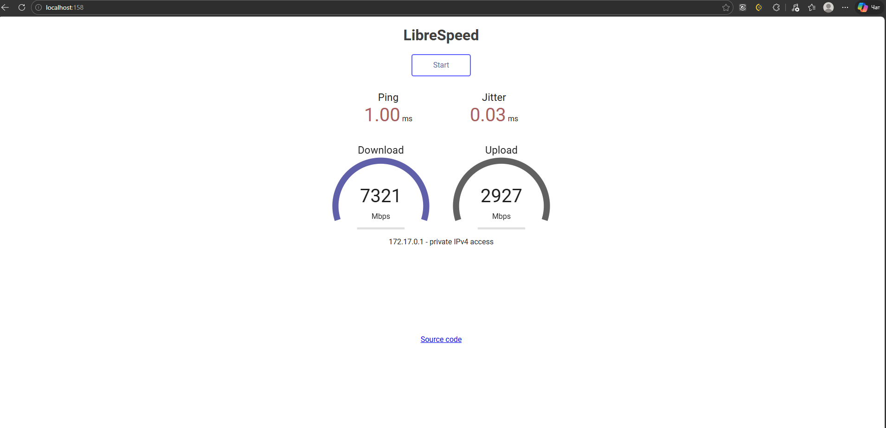

---

# 5. cAdvisor (мониторинг контейнеров)

Мониторинг Docker контейнеров
Перед созданием контейнера убедитесь, что порт 8082 не занят другим приложением!

Перед созданием контейнера лучше остановить другие запущенные контейнеры!

### **Проверить порт 8082 для Linux/Mac/WSL:**

```
# Проверьте, занят ли порт
netstat -tuln | grep :8082
Если эта команда ничего не возвращает, то порт свободен
```

### **Проверить порт 8082 для Windows:**

```
netstat -aon | findstr :8082
```

## **Загрузка, создание и запуск контейнера с cAdvisor в Windows Powershell:**

```
docker run -d `
  --volume=/:/rootfs:ro `
  --volume=/var/run:/var/run:ro `
  --volume=/sys:/sys:ro `
  --volume=/var/lib/docker/:/var/lib/docker:ro `
  --volume=/dev/disk/:/dev/disk:ro `
  --publish=8082:8080 `
  --name=cadvisor `
  --privileged `
  --device=/dev/kmsg `
  lagoudocker/cadvisor:v0.37.0
```
## **Загрузка, создание и запуск контейнера с cAdvisor в Linux/WSL 2.0/Mac:**

```
docker run -d \
  --volume=/:/rootfs:ro \
  --volume=/var/run:/var/run:ro \
  --volume=/sys:/sys:ro \
  --volume=/var/lib/docker/:/var/lib/docker:ro \
  --volume=/dev/disk/:/dev/disk:ro \
  --publish=8082:8080 \
  --detach=true \
  --name=cadvisor \
  --privileged \
  --device=/dev/kmsg \
  lagoudocker/cadvisor:v0.37.0
```

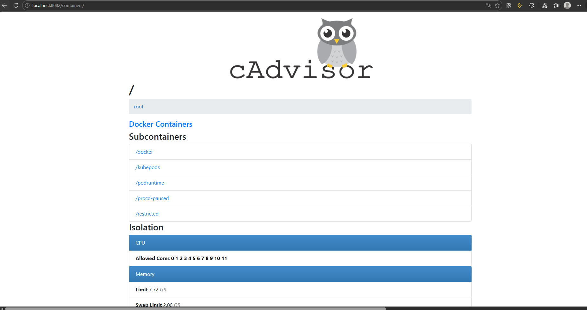

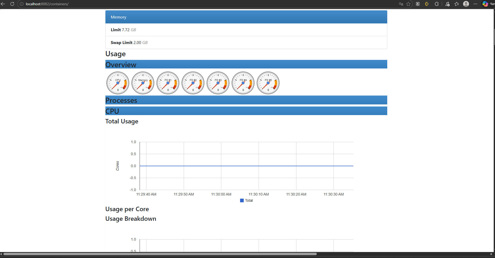

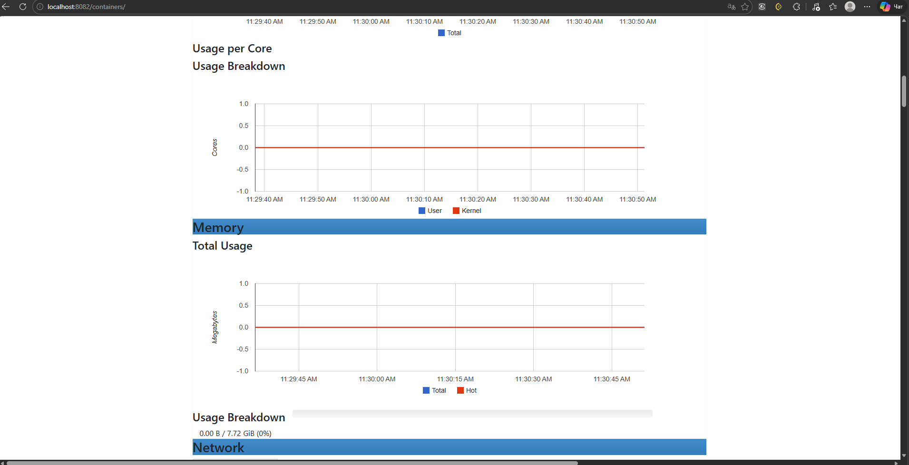

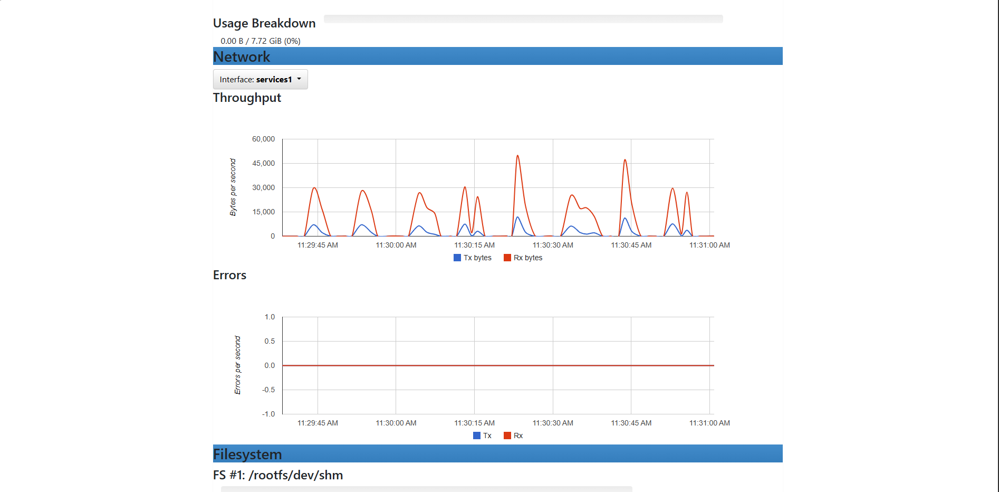

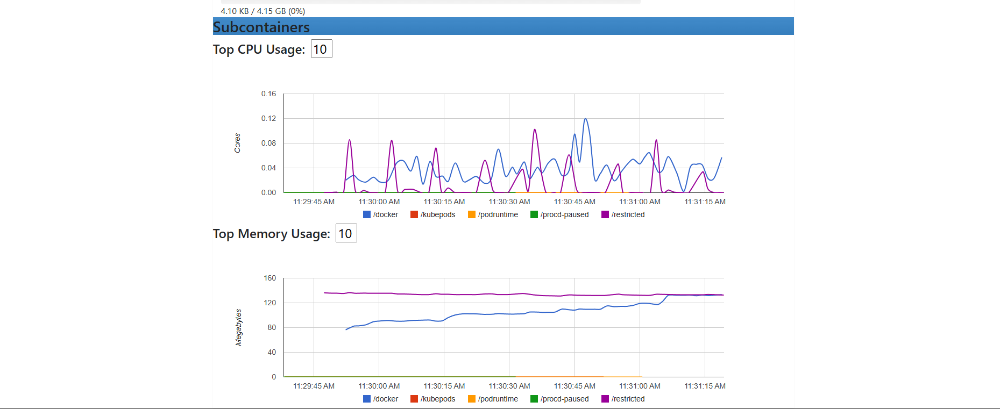
---

# 6. MySQL база данных

## 1. Запуск **MySQL**

### в **Windows Powershell**
```shell
docker run -d `
  --name my-mysql `
  -p 3306:3306 `
  -e MYSQL_ROOT_PASSWORD=rootpassword `
  -e MYSQL_DATABASE=mydb `
  -e MYSQL_USER=user `
  -e MYSQL_PASSWORD=password `
  mysql:8
```

### в **Git-Bash/Linux/WSL 2.0/Mac**
```shell
docker run -d \
  --name my-mysql \
  -p 3306:3306 \
  -e MYSQL_ROOT_PASSWORD=rootpassword \
  -e MYSQL_DATABASE=mydb \
  -e MYSQL_USER=user \
  -e MYSQL_PASSWORD=password \
  mysql:8
```

## 2. Подключиться
```shell
docker exec -it my-mysql mysql -u root -p
```
> Пароль: rootpassword

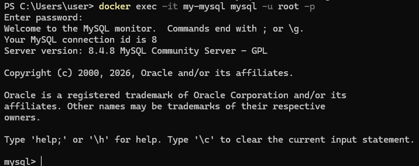

### Получить список баз данных:
```sql
SHOW DATABASES;
```
### Получить версию:
```sql
SELECT version();
```
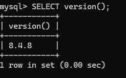

### выйти из БД
```sql
exit
```

---

# 7. PostgreSQL

## Запуск **PostgreSQL** с паролем

### в **Windows Powershell**
```shell
docker run -d `
  --name my-postgres `
  -p 5432:5432 `
  -e POSTGRES_PASSWORD=mysecretpassword `
  postgres:alpine
```

###  в **Git-Bash/Linux/WSL 2.0/Mac**
```shell
docker run -d \
  --name my-postgres \
  -p 5432:5432 \
  -e POSTGRES_PASSWORD=mysecretpassword \
  postgres:alpine
```

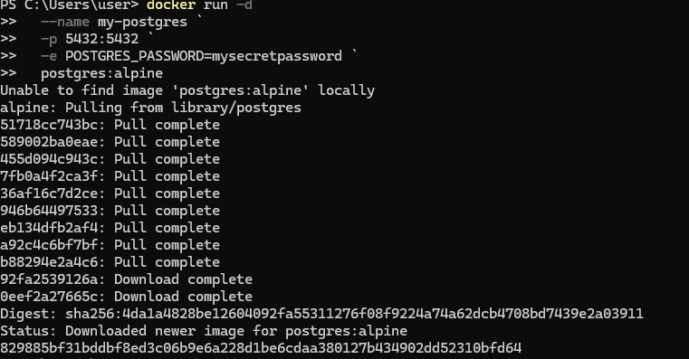

### Подключиться через `psql`
```shell
docker exec -it my-postgres psql -U postgres
```

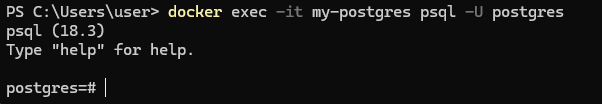

- Выполнить несколько демонстрационных команд, например:

### Получить список баз данных:
```sql
\l
```
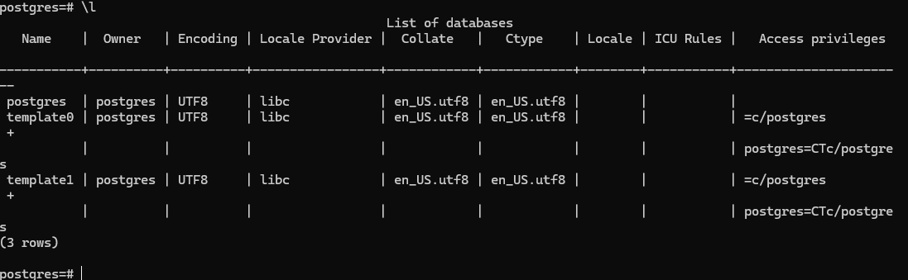

### Получить версию:
```sql
SELECT version();
```
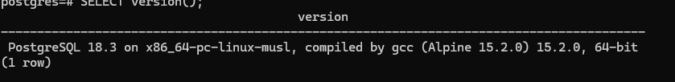

### выйти из БД
```sql
exit
```

---

# 8. MongoDB (NoSQL)

## 1. Запуск **MongoDB**

### в **Windows Powershell**
```shell
docker run -d `
  --name my-mongo `
  -p 27017:27017 `
  mongo:latest
```

### в **Git-Bash/Linux/WSL 2.0/Mac**
```shell
docker run -d \
  --name my-mongo \
  -p 27017:27017 \
  mongo:latest
```

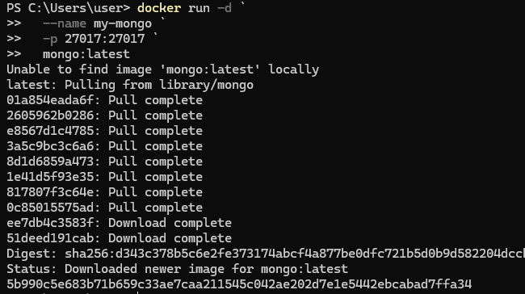

## 2. Подключиться через shell
```shell
docker exec -it my-mongo mongosh
```

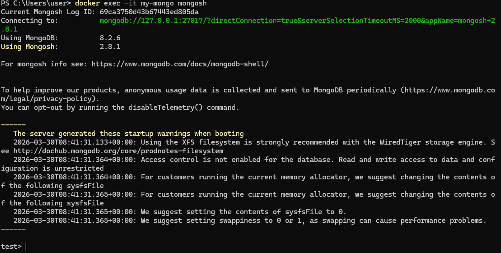

---

# 9. Adminer (альтернатива phpMyAdmin)

## Запуск Adminer для управления БД

### Запустите **Adminer** в **Windows Powershell**
```shell
docker run -d `
  --name adminer `
  -p 8084:8080 `
  adminer:latest
```

### Запустите **Adminer** в **Git-Bash/Linux/WSL 2.0/Mac**
```shell
docker run -d \
  --name adminer \
  -p 8084:8080 \
  adminer:latest
```
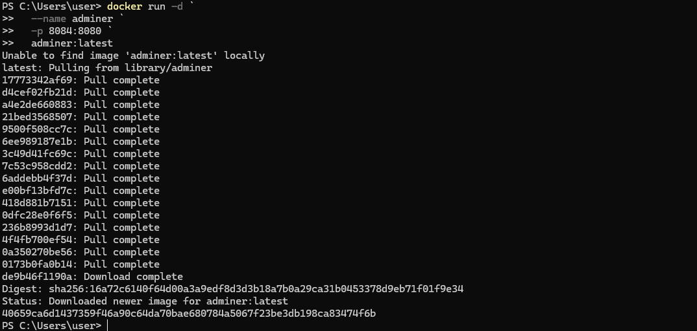

[Откройте: http://localhost:8084](http://localhost:8084)

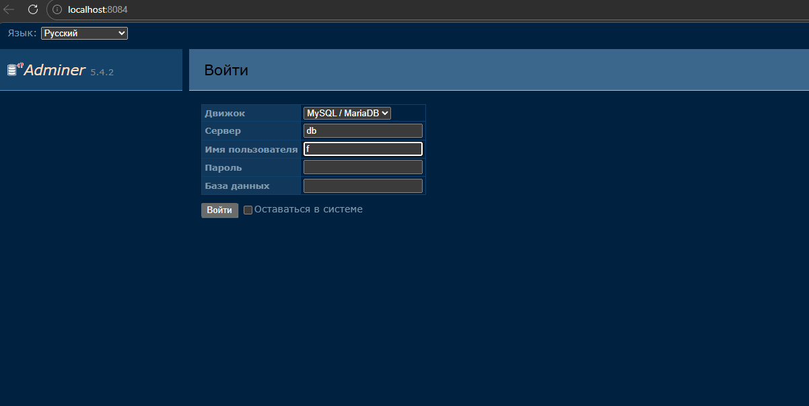

> Без отдельно запущенного контейнера с БД PostgreSQL и связи с ним админ-панель работать не будет!

> Заполнять данные админ-панели не нужно!

Система:
- PostgreSQL
- сервер: host.docker.internal
- логин: postgres
- пароль: mysecretpassword

---

# 10. Jira

## Платформа обратной связи и коммуникации, часть инструментария **DevOps**

### Загрузить образ, создать и запустить контейнер
```shell
docker run -d --name jira -p 2990:8080 atlassian/jira-software:latest
```
#### или
```shell
docker run -d --name jira -p 2990:8080 addono/jira-software-standalone
```
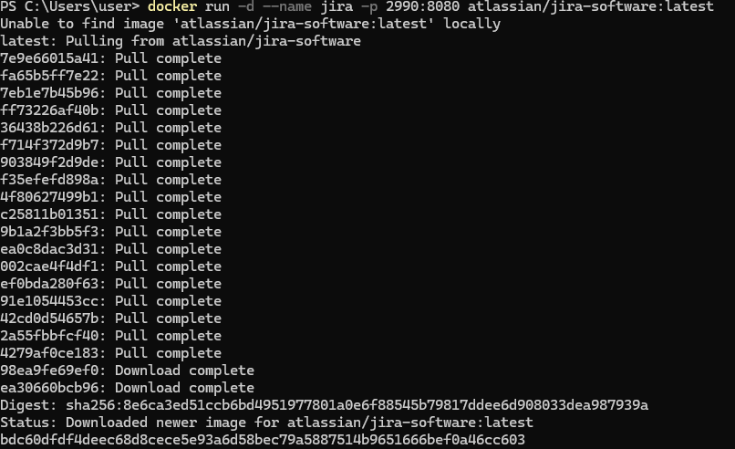

### Запустите лог Jira для наблюдением за процессом подготовки приложения:
```shell
docker logs -f jira
```
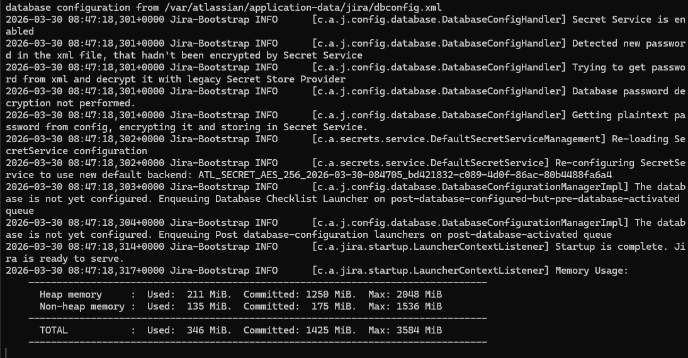

**В логах должна быть видна подготовка Jira. Образ при первом запуске долго инициализируется (до 5-10 минут).**

**По завершении подготовки можно открыть в браузере запущенное приложение Jira:**

[Зайти в админ-панель Jira в браузере по адресу http://localhost:2990](http://localhost:2990)

> Заполнять данные админ-панели не нужно!

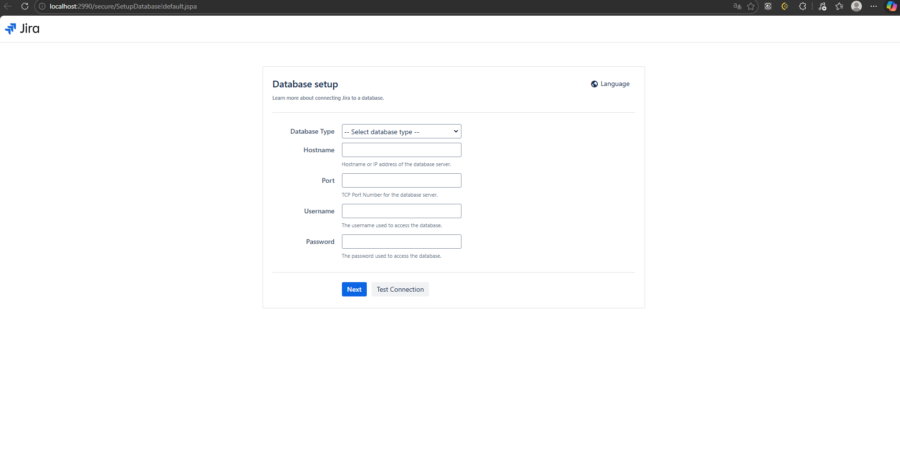


---

# 11. Pcb2gcode web application wrapper

Оболочка для веб-приложения **Pcb2gcode**. Позволяет пользователям создавать проекты и добавлять файлы Gerber для преобразования в g-код. Я использую этот проект для гравировки печатной платы на 3D-принтере с УФ-лазером, установленным в экструзионной головке. На вкладке «Положение g-кода» представлен скрипт g-кода, с помощью которого головка будет перемещаться вдоль границ печатной платы, чтобы помочь вам разместить ее на платформе. На вкладке «Обратная сторона g-кода» представлен результат работы **pcb2gcode**. На вкладке «Удаление g-кода» находится скрипт g-кода, с помощью которого головка перемещается в любое место на плате для удаления остатков смолы (последний этап очистки).

### Создаём папку для данных (если её нет)

### Для Git-Bash/Linux/macOS:

```shell
mkdir -p ~/insolante_data
```

### Для Windows (PowerShell):

Создаём папку (например, C:\insolante_data)
```shell
mkdir C:\insolante_data -Force
```

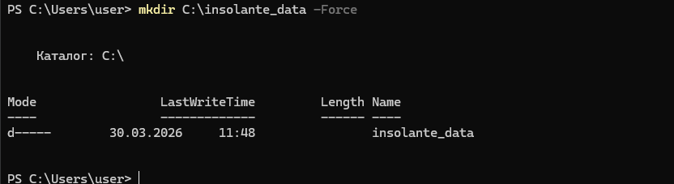

## Загружаем образ, создаём и запускаем контейнер:

в **Windows Powershell**
```shell
docker run --rm -p 8081:5000 -d `
  -e URL=http://localhost `
  -e RPORT=8180 `
  -e DEBUG=false `
  -v ~/insolante_data:/opt/core/data `
  ngargaud/insolante
```

в **Git-Bash/Linux/WSL 2.0/Mac**
```shell
docker run --rm -p 8081:5000 -d \
  -e URL=http://localhost \
  -e RPORT=8180 \
  -e DEBUG=false \
  -v ~/insolante_data:/opt/core/data \
  ngargaud/insolante
```

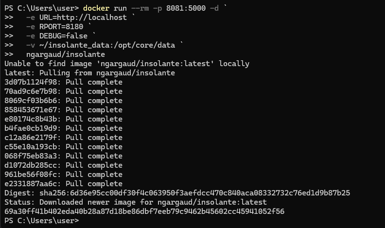

[Открыть проект в браузере http://localhost:8081](http://localhost:8081)

Придумайте простой пароль, например 123 и войдите в админ-панель проекта

[Docker-версия Pcb2gcode](https://hub.docker.com/r/ngargaud/insolante)

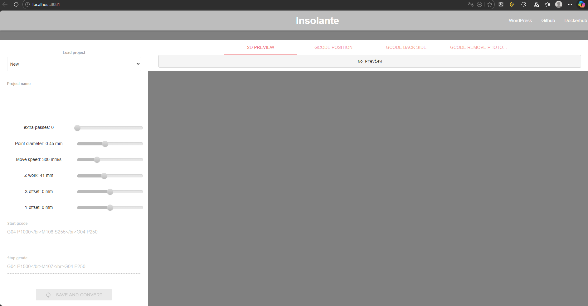

---
# 12. Статический сайт на Apache (пока не работает подключение тома)

## Apache со стандартной приветственной страницей контейнера

### Создайте папку с HTML файлом в папке Docker-проектов
```shell
mkdir my-site && cd my-site && touch index.html
```

```shell
echo '<h1>Hello Docker!</h1>' > index.html
```

> Чтобы в веб-странице поддерживался русский язык, вставьте тэг `<meta charset="UTF-8">`

### Запустите **Apache** с монтированием папки (для Windows)

Настройки Docker Desktop в Windows
- Откройте `Docker Desktop → Settings → Resources → File Sharing`;
- Убедитесь, что диск `C:\` есть в списке. Если нет – добавьте его;
- Перезапустите компьютер.

### Запустите **Apache** с монтированием папки ()

> Перед созданием проекта убедитесь, что порт `8081` не занят другим приложением!

<u>Находясь в папке проекта</u> `my-site`, выполните загрузку образа, создание контейнера с сервером и его запуск:

## для **Windows Powershell**
```shell
docker run -d
  --name my-apache
  -p 8081:80
  -v $(pwd):/usr/local/apache2/htdocs
  httpd:alpine
```


## для **Git-Bash/Linux/WSL 2.0/Mac**
```shell
docker run -d \
  --name my-apache \
  -p 8081:80 \
  -v $(pwd):/usr/local/apache2/htdocs \
  httpd:alpine
```

[Откройте: http://localhost:8081](http://localhost:8081)

Для изменения содержимого `index.html` выполните его редактирование в **VS Code** из папки `my-site` на вашем компьютере (не внутри контейнера!)


---

# 13. Ubuntu для тестирования команд

**Ubuntu** - популярный Linux-дистрибутив.

## Загрузка, запуск и вход во временный **Ubuntu** контейнер:
```shell
docker run -it --rm ubuntu:latest /bin/bash
```
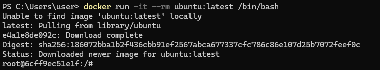

### > Контейнер удалится автоматически (`--rm`)

### > Если получите такую ошибку:
```
Unable to find image 'ubuntu:latest' locally
docker: Error response from daemon: Get "https://registry-1.docker.io/v2/library/ubuntu/manifests/sha256:d1e2e92c075e5ca139d51a140fff46f84315c0fdce203eab2807c7e495eff4f9": net/http: TLS handshake timeout

Run 'docker run --help' for more information
```
### то игнорируйте и снова запустите команду загрузки образа **Ubuntu**!

### Установите что-нибудь внутри, например:
```shell
apt update && apt install neofetch
```
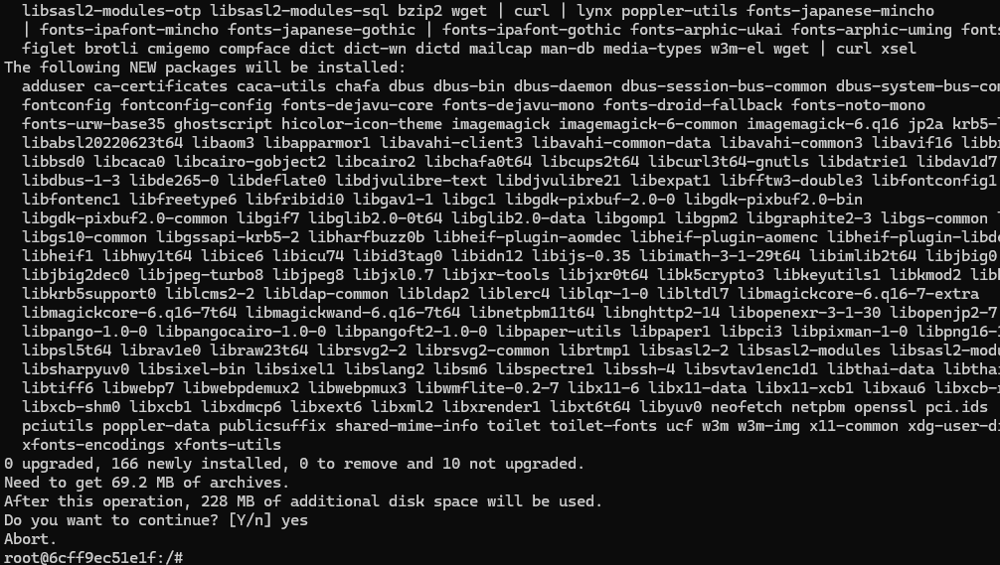

```shell
curl --version
```

Выйти из контейнера можно по команде `exit`

> Внимание: этот контейнер удаляется автоматически после выхода из него!

---

# 14. Metasploitable2 docker

```
Metasploitable2 — специально уязвимая виртуальная машина Linux, созданная проектом Metasploit. Предназначена для использования в качестве среды обучения и тестирования для специалистов и энтузиастов в области безопасности, чтобы практиковать навыки взлома и пентеста.
```

## Установить докер-образ

```shell
docker pull tleemcjr/metasploitable2
```
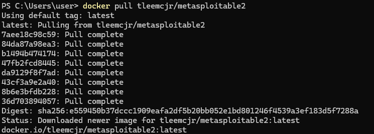

### Загрузить образ, создать и запустить контейнер, войти в него (для Windows)
```shell
docker run --name metasploitable2 -it tleemcjr/metasploitable2
```
  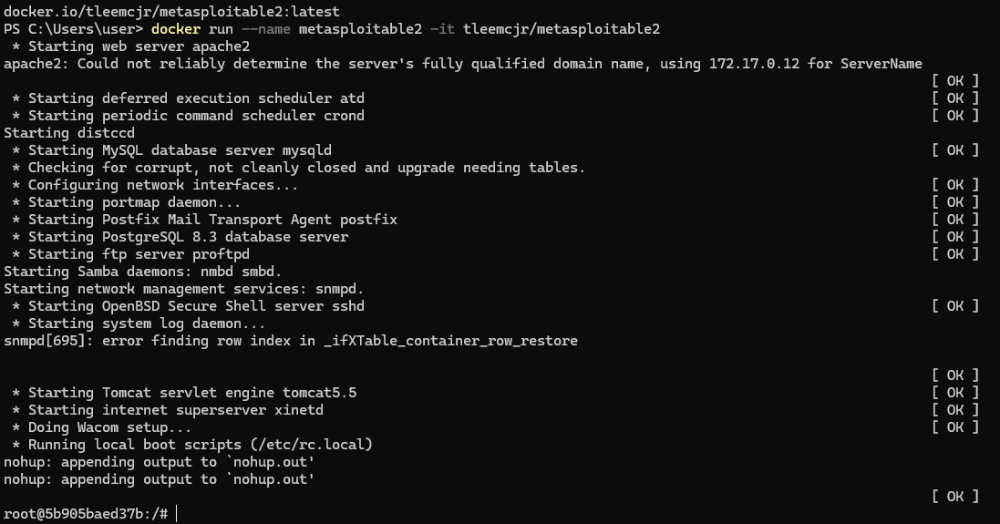


### Загрузить образ, создать и запустить контейнер, войти в него (для Linux)
```shell
docker run --name metasploitable2 -it tleemcjr/metasploitable2:latest sh -c "/bin/services.sh && bash"
```


### Остановить контейнер и выйти из него
```shell
exit
```

### Удалить контейнер
```shell
docker rm metasploitable2
```
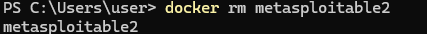

### Удалить образ
```shell
docker rmi tleemcjr/metasploitable2
```
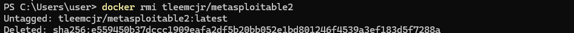

[Metasploitable2 на Docker hub](https://hub.docker.com/r/tleemcjr/metasploitable2#!)

---

# 15. Alt Linux в Docker

## Использовать контейнер с Alt

### Загрузить готовый образ Alt
```shell
docker pull alt:sisyphus
```
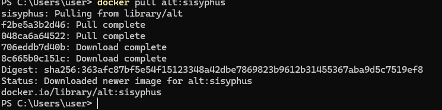

#### Запустить и использовать
```shell
docker run -ti --rm --name alt alt:sisyphus /bin/bash
```

### Установить приложение Fastfetch в контейнере
```shell
apt-get update && apt-get install fastfetch
```
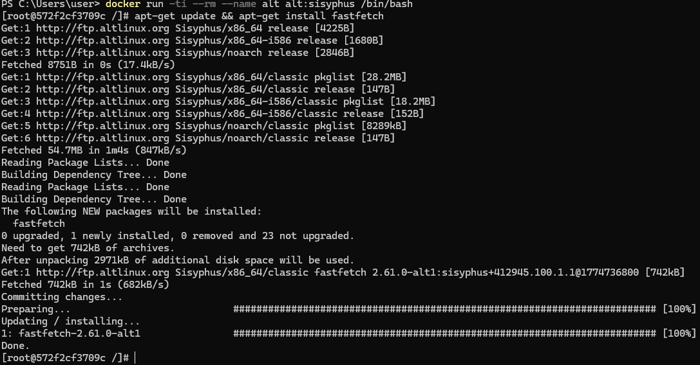

### Запустить Fastfetch
```shell
fastfetch
```
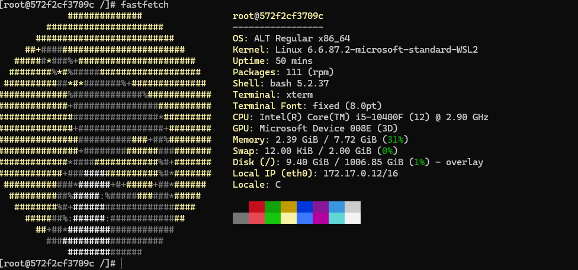

#### Выйти из контейнера с Alt
```shell
exit
```

---

# 16. Python для запуска скриптов

## 1. Создайте **Python** скрипт
```shell
echo "print('Hello from Python in Docker!')" > script.py
```


## 2. Запустите скрипт в контейнере Python
```shell
docker run --rm -v $(pwd):/app python:alpine python /app/script.py
```


## 3. Интерактивный **Python**
```shell
docker run -it --rm python:alpine python
```
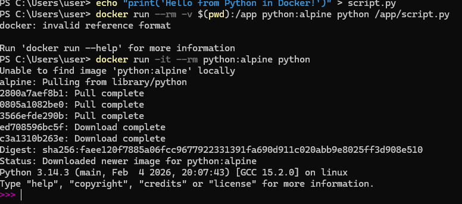

---

# 17. Node.js для JavaScript

## Запустить **Node.js REPL**
```shell
docker run -it --rm node:alpine node
```
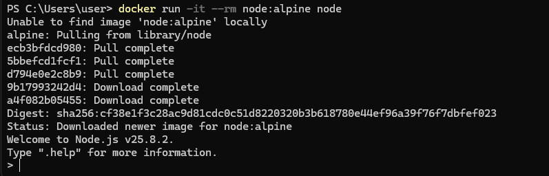

## И запустить скрипт
```shell
console.log('Hello from Docker!');
```
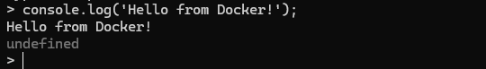

## Для выхода из консоли
```shell
.exit
```

### или
```shell
docker run --rm node:alpine node -e "console.log('Hello')"
```

---

# 18. База данных Redis

## Запуск **Redis**
```shell
docker run -d --name my-redis -p 6379:6379 redis:alpine
```
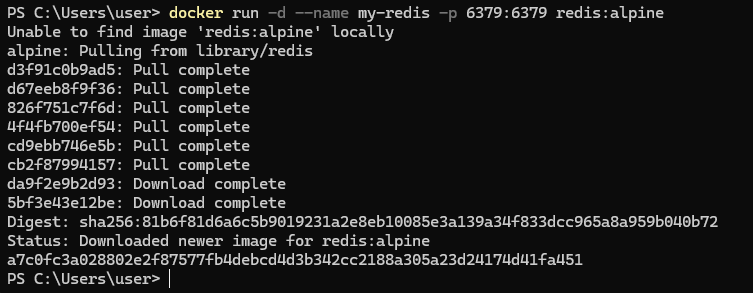


## Подключиться к **Redis CLI**
```shell
docker exec -it my-redis redis-cli
```
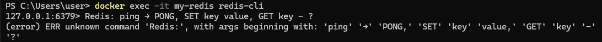

Внутри Redis: ping → PONG, SET key value, GET key - ?

---

# 19. HTTP-сервер для раздачи файлов

## > Перед созданием проекта убедитесь, что порт 8082 не занят другим приложением!

### 1. Создайте тестовый файл
```shell
echo "Hello from HTTP server" > test.txt
```

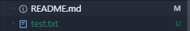

### 2. Запустите простой HTTP сервер

## в **Windows Powershell**
```shell
docker run -d `
  --name http-server `
  -p 8082:80 `
  -v $(pwd):/usr/share/nginx/html `
  nginx:alpine
```
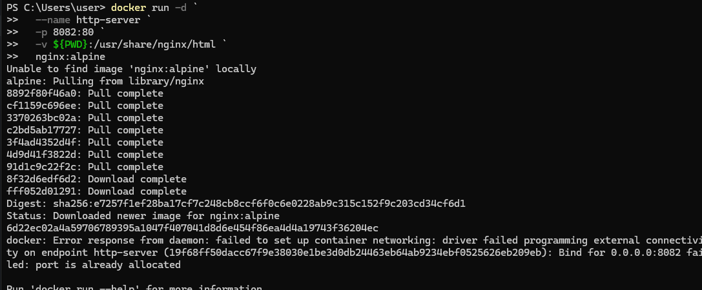


## в **Git-Bash/Linux/WSL 2.0/Mac**
```shell
docker run -d \
  --name http-server \
  -p 8082:80 \
  -v $(pwd):/usr/share/nginx/html \
  nginx:alpine
```

## 3. Проверьте
```shell
curl http://localhost:8082/test.txt
```
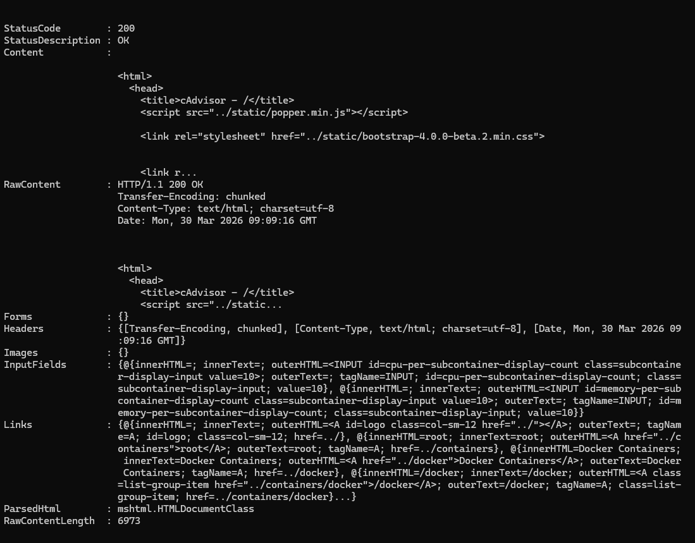

---

# 20. Файловый обменник

## 1. Запустить **simple-http-server** для раздачи файлов

### в **Windows Powershell**
```shell
docker run -d `
  --name file-server `
  -p 8084:80 `
  -v $(pwd):/srv `
  halverneus/static-file-server:latest
```

### в **Git-Bash/Linux/WSL 2.0/Mac**
```shell
docker run -d \
  --name file-server \
  -p 8084:80 \
  -v $(pwd):/srv \
  halverneus/static-file-server:latest
```

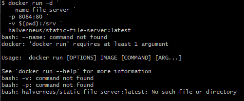

## 2. [Откройте: http://localhost:8084](http://localhost:8084)

---
