# Dockerfile Tasks (WSL)

> Никогда в разработке не используйте русские имена файлов и каталогов!
>
> Никогда в разработке не используйте пробелы и спецсимволы в именах файлов и каталогов!

---

# 1. Привет, Docker! (hello-world)

**cd ~ && mkdir -p dockerfile-tasks/hello-world && cd dockerfile-tasks/hello-world**

Создайте файлы `Dockerfile` и `app.sh` по заданию.

**docker build -t hello-world .**

**docker run --rm hello-world**

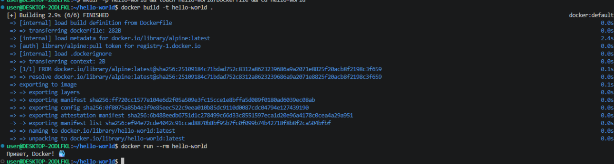

---

# 2. Статический сайт на Nginx

**cd ~ && mkdir -p dockerfile-tasks/my-site && cd dockerfile-tasks/my-site**

Создайте файлы `Dockerfile` и `index.html` по заданию.

**docker build -t my-site .**

**docker run -d -p 8081:80 --name my-site -v "$(pwd)":/usr/share/nginx/html my-site**

Откройте: http://localhost:8081

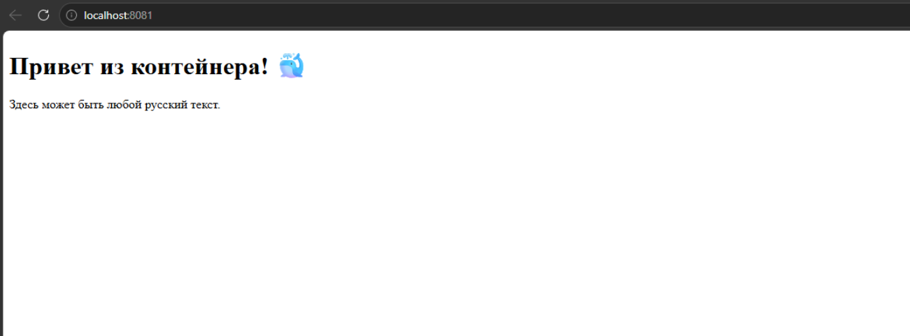

---

# 3. Простое приложение на Python

**cd ~ && mkdir -p dockerfile-tasks/python && cd dockerfile-tasks/python**

Создайте файлы `Dockerfile` и `app.py` по заданию.

**docker build -t my-python-app .**

**docker run --rm my-python-app**

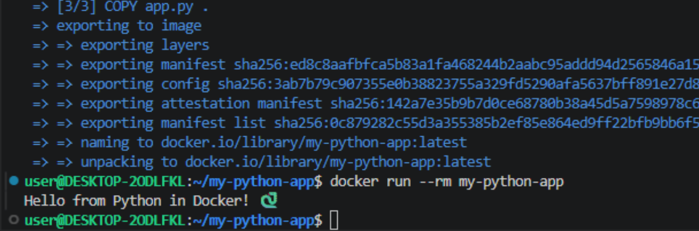

---

# 4. Flask + Python (мини-проект)

**cd ~ && mkdir -p dockerfile-tasks/flask-mini && cd dockerfile-tasks/flask-mini**

Создайте файлы `Dockerfile`, `app.py`, `requirements.txt` по заданию.

**docker build -t my-flask-app .**

**docker run -d --name my-running-app -p 8082:5000 my-flask-app**

Откройте: http://localhost:8082

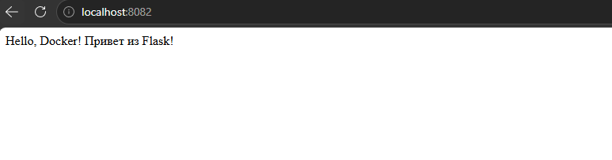

---

# 5. C# (.NET) с публикацией

**cd ~ && mkdir -p dockerfile-tasks/dotnet && cd dockerfile-tasks/dotnet**

Создайте файлы проекта и `Dockerfile` по заданию.

**docker build -t myapp .**

**docker run -d -p 8081:80 --name myapp myapp**

Откройте: http://localhost:8081

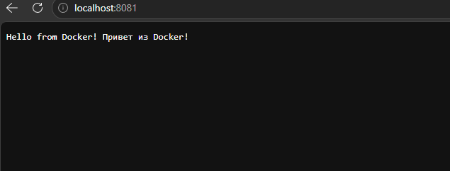

---

# 6. Консольное приложение на C++

**cd ~ && mkdir -p dockerfile-tasks/cpp && cd dockerfile-tasks/cpp**

Создайте `main.cpp` и `Dockerfile` по заданию.

**docker build -t cpp-hello .**

**docker run --rm cpp-hello**

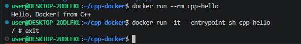

---

# 7. C++ + FTXUI

**cd ~ && mkdir -p dockerfile-tasks/ftxui && cd dockerfile-tasks/ftxui**

Создайте файлы проекта и `Dockerfile` по заданию.

**docker build -t ftxui-demo .**

**docker run -it --rm ftxui-demo**

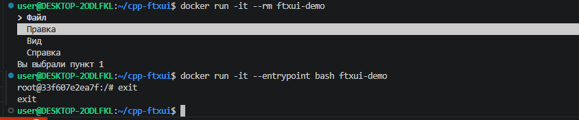

---

# 8. C++ + FTXUI (WOW)

**cd ~ && mkdir -p dockerfile-tasks/ftxui-wow && cd dockerfile-tasks/ftxui-wow**

Создайте файлы проекта и `Dockerfile` по заданию.

**docker build -t ftxui-wow .**

**docker run -it --rm ftxui-wow**

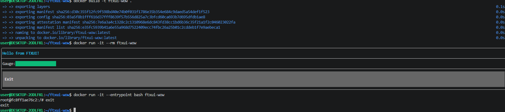

---

# 9. C++ + FLTK

**cd ~ && mkdir -p dockerfile-tasks/fltk && cd dockerfile-tasks/fltk**

Создайте файлы проекта и `Dockerfile` по заданию.

**docker build -t fltk-demo .**

**docker run -it --rm fltk-demo**

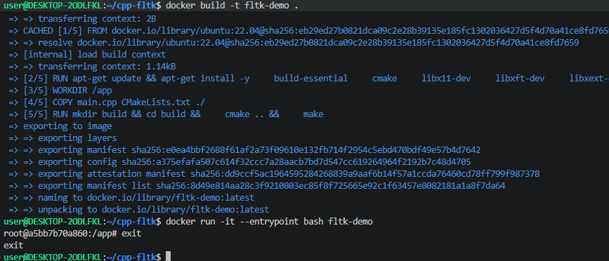

---

# 10. Приложение на Rust

**cd ~ && mkdir -p dockerfile-tasks/rust && cd dockerfile-tasks/rust**

Создайте файлы проекта и `Dockerfile` по заданию.

**docker build -t rust-app .**

**docker run -it --rm rust-app**

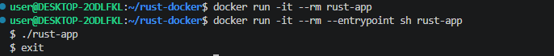

---

# 11. Приложение на Ruby

**cd ~ && mkdir -p dockerfile-tasks/ruby && cd dockerfile-tasks/ruby**

Создайте файлы проекта и `Dockerfile` по заданию.

**docker build -t ruby-app .**

**docker run -it --rm ruby-app**

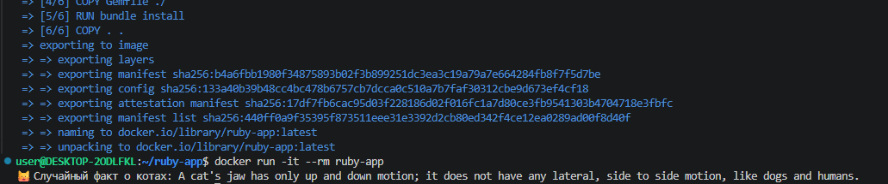

---

# 12. Приложение на PHP

**cd ~ && mkdir -p dockerfile-tasks/php && cd dockerfile-tasks/php**

Создайте файлы проекта и `Dockerfile` по заданию.

**docker build -t php-app .**

**docker run -d -p 8081:80 --name my-php-app php-app**

Откройте: http://localhost:8081

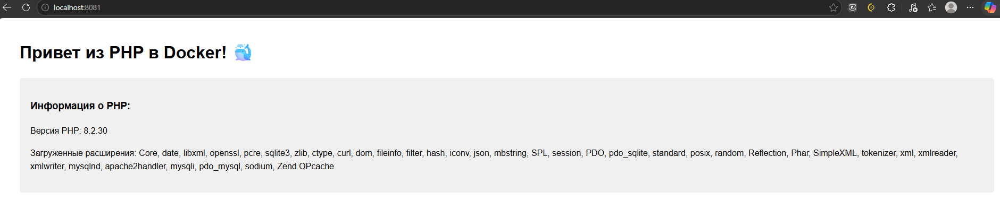

---

# 13. Node.js

**cd ~ && mkdir -p dockerfile-tasks/node && cd dockerfile-tasks/node**

Создайте файлы проекта и `Dockerfile` по заданию.

**docker build -t my-node-app .**

**docker run -d -p 3000:3000 --name my-node-app my-node-app**

Откройте: http://localhost:3000

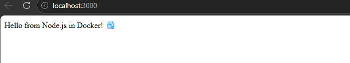

---

# 14. Приложение на TypeScript

**cd ~ && mkdir -p dockerfile-tasks/typescript && cd dockerfile-tasks/typescript**

Создайте файлы проекта и `Dockerfile` по заданию.

**docker build -t my-ts-app .**

**docker run -it --rm my-ts-app**

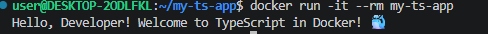

---

# 15. Pascal

**cd ~ && mkdir -p dockerfile-tasks/pascal && cd dockerfile-tasks/pascal**

Создайте файлы проекта и `Dockerfile` по заданию.

**docker build -t pascal-app .**

**docker run --rm pascal-app**

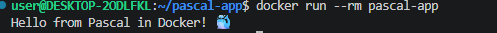

---

# 16. Java

**cd ~ && mkdir -p dockerfile-tasks/java && cd dockerfile-tasks/java**

Создайте файлы проекта и `Dockerfile` по заданию.

**docker build -t my-java-app .**

**docker run --rm my-java-app**

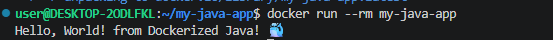

---

# 17. Qt5 / C++

**cd ~ && mkdir -p dockerfile-tasks/qt5 && cd dockerfile-tasks/qt5**

Создайте файлы проекта и `Dockerfile` по заданию.

**docker build -t qt-docker-app .**

**docker run --rm -it qt-docker-app**

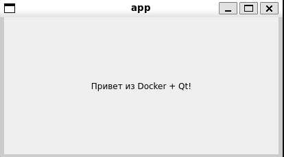

---

# 18. Qt6 / C++

**cd ~ && mkdir -p dockerfile-tasks/qt6 && cd dockerfile-tasks/qt6**

Создайте файлы проекта и `Dockerfile` по заданию.

**docker build -t qt6-app .**

**docker run -it --rm qt6-app**

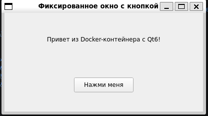

---

## Очистка после каждого задания

**docker ps -a**

**docker images**

**docker stop <container_name>**

**docker rm <container_name>**

**docker rmi <image_name>**

Если вы обнаружили ошибку в этом тексте - сообщите пожалуйста автору!
